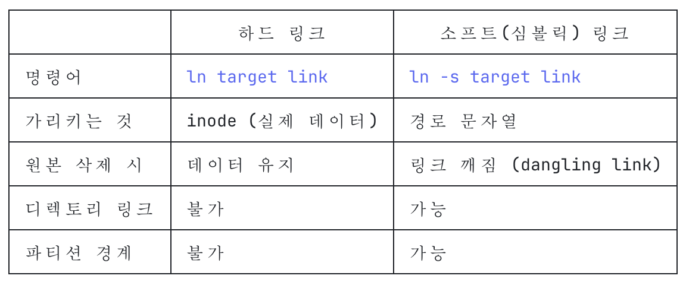

# Linux

## File System

### 8) 파일 관련 명령

- `ln`: 링크를 만드는 명령
    - `심볼릭 링크`
        - 디렉토리를 하드 링크를 만들 수 없어서 디렉토리를 링크하고자 하는 경우에 생성
        - 심볼릭 링크를 만들 떄는 `-s`를 추가해서 생성
        - `ln -s target link`
        - 심볼릭 링크는 원본 파일 이름에 대한 링크
        - 심볼릭 링크를 삭제해도 원본 파일에는 아무런 영향이 없지만 원본 파일을 삭제하면 심볼릭 링크는 깨진 상태가 됨
        

    - 실습
        - 파일을 생성하고 작성 - `vi data.txt`
        - 심볼릭 링크 생성: `ln -s data.txt data.sl`
        - 내용을 수정하면 양쪽 파일에 다 적용이 된다.

- `grep`

    - 파일 내용을 검색하는 명령
    - 정규 표현식 사용 가능
    - 형식
        - `grep [옵션] [패턴] [파일경로]`
    - 옵션
        - `i`: 대소문자 구분 없이 검색
        - `l`: 지정한 패턴이 포함된 파일 이름을 출력
        - `n`: 행 번호 출력
    - 실습
        - 파일을 복사: `cp /etc/services data`
        - data 파일에서 NNTP를 검색(대소문자 구분 없이 검색): `grep -i nntp data`

- `find`
    - 리눅스의 디렉토리 계층 구조에서 특정 파일이 어떤 디렉토리에 있는지 찾아주는 명령으로 파일의 생성 일자와 이름, 소유자 등 다양한 조건에 맞는 파일을 검색
    - 검색한 후 동작 수행도 가능
    - 형식
        - `find [경로] [검색 조건] [동작]`
    - 검색 조건
        - `-name 파일명`
        - `-type 파일종류`
        - `-user 아이디`
        - `-group 그룹이름`
        - `-perm 접근권한`
        - `-size 파일크기`
        - `-newer FILE`: 기준 파일보다 최근에 수정된 파일 검색
        - `-newermt 시간`: 지정한 날짜/시간보다 최근에 수정된 파일 검색
    - 동작 
        - `-exec 명령 {} \;`: 파일에 명령을 실행
        - `-ok 명령 {} \;`: 사용자의 확인을 받아서 실행
        - `-print`: 검색된 파일의 절대 경로를 출력하는데 기본 동작
        - `-ls`: 검색 결과를 목록 형식으로 출력
    - 실습
        - 이름으로 검색: `find -name data -print`
        - 와일드카드 문자를 사용할 수 있는데 이 때는 이름을 ''로 묶어 줘야함.
            - `find -name 'data*' -print`

        - 타입으로 검색: `find /etc -type d` : /etc 디렉토리에서 타입이 directory인 것 찾기
        - 시간으로 검색: `find /home -newermt "2026-07-20"`
        - 명령 수행(삭제): `find ~/practice -name data -exec rm -f {} \;`
        - 특정 크기 이상 파일 찾기: `find /usr/share -size 5M`
        - 현재 디렉토리(및 하위 디렉토리)에서 이름이 .swp로 끝나는 파일을 찾는 명령: `find -name "*.swp"`

- `locate`
    - 파일이나 디렉토리를 검색하는 명령어
    - find와 차이점
        - 검색 속도가 빠름
        - 옵션이 제한적
        - 파일이나 디렉토리를 데이터베이스화 해서 검색

    - 설치
        - 확인: `lacate --version`
        - 설치: `sudo apt install plocate`
    - 데이터베이스 구축: `sudo updatedb`
    - 파일 검색
        - `locate [옵션] <패턴>`

- `wc`
    - 파일 또는 표준 입력에서 단어 수, 줄 수, 문자 
    - 형식
        - `wc [옵션] [파일 경로]`
    - 옵션
        - `-l`: 줄 수
        - `-w`: 단어 수
        - `-c`: 바이트 수
        - `-m`: 문자 수
        - `-L`: 가장 긴 줄의 길이

- `awk`
    - 패턴을 기반으로 텍스트 파일, 스트림 및 기타 데이터 형식을 조작하고 처리

- `sed`
    - 스트림 편집기
    - 파일 내용 수정이나 텍스트 치환, 라인 삭제 등을 편리하게 수행해주는 명령어

### 9) 파일 접근 권한 관리

- 개요
    - 다중 사용자 시스템은 사용자의 파일에 마음대로 접근하지 못하도록 보안 기능을 제공
    - 파일의 접근 권한 확인: `ls -l`

- 그룹
    - 파일이 속한 그룹의 이름
    - 그룹에 속한 사용자들에게 권한을 부여해서 파일을 공유할 수 있도록 
    - 그룹이 정의된 파일은 /etc/group 인데 시스템 관리자만 수정이 가능
    - 사용자가 속한 그룹을 알려주는 명령은 groups

- 권한 종류
    - 읽기: 파일의 내용을 읽거나 복사할 수 있으며 디렉토리의 경우는 ls 명령으로 디렉토리의 목록은 볼 수 있으나 옵션은 실행 권한이 있어햐 함
    - 쓰기: 파일을 수정, 이동, 삭제할 수 있고 디렉토리 안에 파일을 생성하거나 삭제할 수 있음
    - 실행: 파일을 실행할 수 있고 디렉토리의 경우는 cd 명령을 사용할 수 있음

- 파일 접근 권한 변경: `chmod`
    - 형식: `chmod [옵션] 권한 [파일이나 디렉토리 경로]`
    - 옵션
        - `R`: 하위 디렉토리까지 모두 변경
    - 권한 설정 방법
        - 기호 모드
        - 숫자 모드
    - 기호 모드
        - `chmod 사용자카테고리문자 연산자기호 접근권한문자 경로`

        - 사용자 카테고리 문자
            - `u`: 파일 소유자
            - `g`: 그룹
            - `o`: 기타
            - `a`: 전체
        - 연산자 기호
            - `+`: 추가
            - `-`: 제거
            - `=`: 설정
        - 접근 권한 문자
            - `r`
            - `w`
            - `x`
        - 예시
            - u + w: 소유자에게 쓰기 권한 추가
        - 실습
            -  실습한 디렉토리 및 파일을 복사
                - `mkdir ex && cd ex && cp /etc/hosts test.txt`

            - test.txt 파일에 그룹 사용자에게 쓰기와 실행 권한 부여
                - `chmod g+wx test.txt`
    - 숫자 모드
        - 소유자, 그룹, 기타 사용자를 각각 묶어서 8진수로 권한을 나타낸다.
        - 권한이 있는 자리는 1 없는 자리는 0
        - test.txt 파일에 읽기 권한들만 부여: `chmod 444 test.txt`
        - test.txt 파일의 소유자에게 모든 권한을 부여하고 나머지에게는 권한을 전혀 부여하지 않기
            - `chmod 700 test.txt`

    - 제일 많이 하는 접근 권한 변경은 스크립트 파일을 만들었을 때 실행 권한 부여하는 것이다.
        - `chmod 754 sample.sh`

- 기본 접근 권한 
    - 파일이나 디렉토리를 생성할 때 자동으로 설정되는 권한
    - 파일의 경우는 파일 소유자와 그룹에는 읽기와 쓰기 권한이 부여되고 기타 사용자에게는 읽기 권한만 부여
    - 디렉토리의 경우는 소유자와 그룹에게는 읽기, 쓰기, 실행 권한이 부여되고 기타 사용자에게는 읽기와 쓰기 권한이 부여된다.

    - 기본 접근 권한 확인 및 변경
        - `unmask [옵션][마스크값]`
    - 마스크는 반대로 적용하는 값: 부여할 대 1인데 마스크에서는 부여할 때 0
    - 옵션은 S가 있는데 문자로 출력
    - 이 권한은 디렉토리의 권한에 해당하며 디렉토리의 권한에서 실행 권한을 뺀 것이 파일에 대한 권한
    - 기본 접근 권한을 수정: 소유자에게는 모든 권한을 부여하고 나머지에게는 권한을 부여하지 않음
        - `umask 077`
```
동작 원리

파일/디렉토리가 생성될 때 시스템이 주는 기본 최대 권한이 있고, 여기서 umask 값만큼 권한을 빼서 실제 생성 권한이 정해집니다.

디렉토리 기본값: 777
파일 기본값: 666 (파일은 기본적으로 실행 권한 없이 생성됨)

실제 권한 = 기본값 & ~(umask)
예시


$ umask
0022
디렉토리: 777 - 022 = 755 (rwxr-xr-x)
파일: 666 - 022 = 644 (rw-r--r--)
즉 umask 022는 "그룹과 다른 사용자에게서 쓰기 권한(2)을 빼라"는 뜻입니다.

확인 및 변경


umask          # 현재 값 확인
umask 027      # 세션에 적용 (그룹 쓰기, 기타 전체 제거)
영구 적용하려면 ~/.bashrc, ~/.zshrc 같은 셸 설정 파일에 umask 027 같은 명령을 추가하면 됩니다.
```

- 특수 접근 권한
    - umask의 맨 앞 자리는 특수 접근 권한
    - 맨 앞 자리의 숫자 0이면 일반적인 접근 권한이고 4이면 SetUID 그리고 2이면 SetGID 이고 1이면 sticky bit
    - SetUID
        - 해당 파일이 실행되는 동안에는 파일을 실행한 사용자의 권한이 아니라 소유자의 권한이 적용
        - 이를 설정하면 소유자의 실행 권한이 s로 조회된다.
            ```sh
            etakyung@linuxv1:~/practice/ex$ ls -l /usr/bin/passwd
            -rwsr-xr-x 1 root root 142552 Feb  3 05:45 /usr/bin/passwd
            ``` 
    - SetGID
        - 해당 파일이 실행되는 동안에는 파일을 실행한 그룹의 권한이 아니라 파일 소유 그룹의 권한이 적용
        - 이를 설정하면 그룹의 실행 권한이 s로 조회된다.
    - sticky bit
        - 디렉토리에 설정하는데 디렉토리에 스트키 비트가 설정되면 이 디렉토리에는 누구나 파일을 생성할 수 있음
        - ex) 디렉토리를 누구나 파일을 생성할 수 있고 소유자는 모든 권한을 다 가지고 그룹 사용자는 읽고 실행이 가능하고 기타 사용자도 읽고 실행이 가능하도록 권한을 수정:
            - `chmod 1755 ex`

## 프로세스 관리

### 1) 프로세스

- 개요
    - 현재 시스템에서 실행 중인 프로그램
    - 리눅스는 다중 프로세스 시스템이므로 여러 개의 프로세스를 동시에 실행
    - 프로세스는 부모-자식 관계
        - `systemd` 와 `kthreadd` 이 두 프로세스를 제외하면 모든 프로세스는 부모 프로세스가 있음

- PID
    - 프로세스를 식별하기 위한 번호
    - 리눅스가 부팅될 때 systemd가 1번을 가지고 실행되고 kthreadd 가 2번으로 실행된다.
    - 유닉스에서는 init 이 1번이었는데 이름이 systemd 로 변경된 것
        ```
        etakyung@linuxv1:~/practice/ex$ ls -l /sbin/init
        lrwxrwxrwx 1 root root 22 Apr 16 03:32 /sbin/init -> ../lib/systemd/systemd
        ``` 

- 프로세스 종류
    - `일반적인 프로세스`: 실행 후 자신의 작업이 종료되면 종료되는 프로세스
    - `daemon 프로세스`
        - 특정 서비스를 제공하기 위해서 존재하며 리눅스 커널에 의해 실행되기 때문에 서비스라고도 한다.
        - 평소에는 대기 상태로 있다가 서비스 요청이 오면 서비스를 제공
        - 리눅스에서는 다양한 서비스를 제공하기 위해서 여러 개의 데몬이 동작

    - `고아 프로세스`
        - 자식 프로세스는 부모 프로세스가 종료되면 같이 종료되어야 하는데 부모 프로세스는 종료되었는데 남아있는 자식 프로세스
        - 1번 프로세스가 고아 프로세스의 새로운 부모 프로세스가 돼서 고아 프로세스가 작업을 마치고 종료될 수 있도록 해야함.
        - 자식 프로세스는 자신의 작업을 종료하면 부모 프로세스에게 돌아가야 하는데 부모 프로세스가 없으면 종료될 수 없음

    - `좀비 프로세스`
        - 자식 프로세스가 종료 정보를 보내고 부모 프로세스의 프로세스 테이블 목록에서 제거되어야 하는데 프로세스 테이블 목록에 남아있는 경우
        - 이러한 프로세스는 프로세스 목록에 `defunct 프로세스`로 나오게 된다.
        - 이러한 프로세스는 증가하면 프로세스 테이블 목록이 가득 차서 정상적인 프로세스가 실행되지 않을 수 있음
        - 좀비 프로세스는 kill 명령으로 제거할 수 없으며 `SIGCHLD` 시그널을 부모 프로세스에게 전송해서 부모 프로세스가 자식 프로세스를 정리하도록 해주어야 한다. 

### 2) 관리 명령

- 목록 확인 명령: `ps`
    - 현재 실행 중인 프로세스에 대한 정보를 출력하는 명령
    - 형식: `ps [옵션]`
    - 유닉스 옵션(-를 앞에 붙여야 함)
        - `-e`: 시스템에서 실행 중인 모든 프로세스 정보 출력
        - `-f`: 자세한 정보 출력
            ```
            etakyung@linuxv1:~/practice/ex$ ps -f
            UID          PID    PPID  C STIME TTY          TIME CMD
            etakyung    9106    9105  0 17:45 pts/0    00:00:00 -bash
            etakyung   15500    9106  0 21:16 pts/0    00:00:00 ps -f
            ```
        - `-u uid`: uid가 실행한 것만
        - `-p pid`: pid를 가진 프로세스의 정보를 출력
    - BSD 옵션(-로 시작하지 않음)
        - `a`: 터미널에서 실행시킨 프로세스의 정보를 출력
        - `u`: 상세 정보를 출력
        - `x`: 시스템에서 실행 중인 모든 프로세스의 정보를 출력
    - 현재 단말기의 프로세스 목록 출력: `ps`

- `pgrep`
    - 특정 프로세스 검색
    - 형식
        - `pgrep [옵션] [패턴]`
    - 옵션
        - `x`: 패턴과 정확히 일치하는 프로세스의 정보를 조회
        - `n`: 패턴을 포함하고 있는 가장 최신의 프로세스 정보를 조회
        - `u` 사용자이름: 사용자가 실행한 프로세스를 조회
        - `l`: PID 와 프로세스 이름을 출력
        - `t 터미널이름`: 특정 터미널과 관련된 프로세스를 조회
    - 이 명령만으로는 프로세스 아이디와 이름까지만 조회가 가능
    - 자주 사용하는 방식
        - `ps -fp $(pgrep -x bash)`

- 프로세스 종료
    - 프로세스 종료할 때는 `kill` 이나 `pkill` 명령을 사용
    - 프로세스를 종료할 때는 상위 프로세스에게 시그널을 전송해야 한다.
    
    - ❗️파일을 열어놓고 수정하면 저장이 안된다. (맥os)

    - `시그널`
        - 프로세스에게 무언가 발생했음을 알리는 간단한 메시지
        - `1`: `SIGHUP` - 종료할 때 발생하는 시그널로 터미널과 연결이 끊긴 것
        - `2`: `SIGINT` - 사용자가 CTRL + c 로 중지한 경우
        - `3`: `SIGQUIT` - 종료 신호로 CTRL + \
        - `9`: `SIGKILL` - 강제로 종료
        - `14`: `SIGALRM` - 알람이 발생해서 종료
        - `15`: `SIGTERM` - kill 명령이 보내는 시그널

    - `kill 명령`
        - 형식: `kill [-시그널] PID`

        - 2개의 터미널에서 접속한 후 작업
        - 하나의 터미널에서 `man ps` 라는 명령을 수행
        - 다른 터미널에서 `ps -ef | grep ps` 명령으로 man 명령의 process id 조회
        - `kill 찾은id`

    - `pkill 명령`
        - 프로세스 명령 이름으로 프로세스를 찾아서 종료하는 명령
        - PID는 구별하기 위한 번호이므로 한 번에 하나만 종료되지만 pkill 은 이름으로 종료하기 때문에 동일한 명령으로 수행된 모든 프로세스가 종료

    - `killall`
        - pkill 과 동일한 기능을 수행하는데 해당 프로세스를 소유하고 있어햐 한다. 내 것이어야 가능

- `top`
    - 프로세스 정보를 주기적으로 출력
    - 출력 정보
        - `PID`: 프로세스 id
        - `USER`: 프로세스 소유자 
        - `PR`: 커널이 사용하는 실제 실행 우선순위 값
        - `NI`: Nice 값으로 사용자가 조정하는 우선순위 값 (-20으로 19까지의 값)
        - `VIRT`: 가상 메모리 크기
        - `RES`: 프로세스가 사용하는 메모리 크기
        - `SHR`: 프로세스가 사용하는 공유 메모리 크기
        - `%CPU`: CPU 사용량
        - `%MEM`: 메모리 사용량
        - `TIME+`: CPU 누적 사용 시간
        - `COMMAND`: 명령 이름

    - top 명령 수행 중에 실행할 수 있는 명령
        - `ENTER, SPACEBAR`: 새로 고침
        - `k`: 프로세스 종료
        - `n`: 출력하는 프로세스 개수 변경
        - `u`: 사용자 별로 정렬
        - `M`: 메모리 크기에 따라 정렬
        - `p`: cpu 사용량에 따라 정렬
        - `q`: 종료

### 3) 작업 제어

- 포그라운드 작업
    - 명령이 수행되면 종료될 때까지 기다리는 방식
    - `sleep 100`: 100초 대기


- 백그라운드 작업
    - `sleep 100 &`
    - 명령을 수행하면 다른 프로세스가 실행되는 동안 뒤에서 수행되는 명령
    - 오래 걸릴 것으로 예상하거나 명령을 수행하고 있는 동안 다른 작업을 할 필요가 있을 때 사용
    - 명령 뒤에 &를 붙이면 된다.
    - 백그라운드 작업을 수행할 때 출력하는 명령을 수행하는 것이라면 출력 방향을 리다이렉션 해야 한다.
        - `find / -name passwd > pw.dat 2>&1 &`
        - (파일시스템 전체에서 passwd라는 이름의 파일을 찾아서, 정상 출력과 에러 메시지를 전부 pw.dat 파일에 저장하면서 백그라운드로 실행하는 명령)

- `jobs`
    - 백그라운드 작업을 전부 출력하는 bash 의 내부 명령
    - 출력 방식
        - `[작업번호] [+는 가장 최근에 접근한 작업이고 -는 + 바로 직전에 접근한 작업이고 공백은 그 이외의 작업] [실행 중, 완료, 종료됨, 멈춤] [명령]`

    - 형식
        - `jobs [%작업번호]`

- 작업 전환
    - `ctrl + z`: 포그라운드 작업을 중지
    - `bg %작업번호`: 작업 번호가 지시하는 작업을 백그라운드로 전환
    - `fg %작업번호`: 작업 번호가 지시하는 작업을 포그라운드로 전환

- 작업 종료
    - 포그라운드 작업은 CTRL + c를 이용해서 종료
    - 다른 터미널에서 해당 프로세스의 PID를 조회해서 kill 이나 pkill 명령으로 포그라운드 작업 종료
    - 백그라운드 작업도 kill 명령으로 종료 가능

- 로그아웃 후에도 백그라운드 작업 계속 실행
    - `nohup 명령 &`

### 4) 작업 예약

- 정해진 시간에 한 번만 실행: `at`
- 설치: `sudo apt install at`
- 형식: `at [옵션] [시각]`
- 옵션
    - `l`: 현재 실행 대기 중인 명령의 전체 목록
    - `r 작업번호`: 현재 실행 대기 중인 명령 중 해당 작업 번호를 삭제
    - `m`: 출력 결과가 없더라도 작업이 완료되면 사용자에게 메일로 알려줌
    - `-f 파일`: 표준 입력 대신 실행할 명령을 파일로 지정(스크립트 파일을 만들어서 스크립트 파일의 내용을 수행)
    - `t [[CC]YY]MMDDhhmm[.ss]`: 정확한 날짜 및 시간 지정
    - `c 작업번호`: 예약된 작업 내용 확인
    - `-q <큐>`: 지정하는 값은 a~z A~Z 인데 실행의 우선순위를 지정하는데 기본은 a

- 시간 설정
    - 절대시간
        - `at 14:30`
        - `at 2026-01-10 03:00`
    - 상대 시간
        - `at 4pm + 3days`
        - `at 10pm Jul 31`
        - `at 1am tomorrow`
        - `at 10:00am today`
        - `at now + 10minutes`
    - 요일 지정
        - `at 10am next Monday`

- 작업 확인: 
    - `/var/spool/cron/atjobs` 파일을 확인하면 된다.
        - `sudo ls -l /var/spool/cron/atjobs`
    - `at -l`
    - `atq`

- 작업 예약(작성 후 종료는 `CTRL + d`)
    ```sh
    $ at 11:13 am # 오전 11:13에 
    at /usr/bin/ls > ~/at.out 에 출력
    ```

- 작업 예약 스크립트 파일 이용
    - `vi at.sh` 명령을 수행하고 아래 내용을 저장하고 종료
    - `at 11:13 am`
    - `at -f /home/etakyung/at.sh 11:19 am`

- 사용 제한
    - 시스템 관리자는 /etc/at.allow 파일과 /etc/at.deny 파일을 이용해서 사용 제한이 가능
    - allow 파일에는 사용 가능한 계정을 작성하고 deny에는 사용 불가능한 계정을 작성
    - allow 파일을 확인해서 계정이 있으면 deny는 무시
    - allow 파일이 없으면 deny 파일에 존재하지 않는 계정은 전부 사용 가능
    - 2개의 파일이 모두 없다면 root 만 사용 가능
    - 초기 설정은 deny이 있는데 비어 있어서 모든 사용자가 가능

- 정해진 시간에 반복 실행: `crontab`
    - 형식
        - `crontab [-u 사용자계정] [옵션] [파일명]`
    - 옵션
        - `e`: 사용자의 crontab 파일을 수정
        - `l`: crontab 파일의 목록을 출력
        - `r`: crontab 파일을 삭제
    - crontab 파일은 사용자 별로 생성되는데 이 파일에 반복 실행할 내용을 저장
    - 여러 개의 작업을 지정할 수 있는데 한 행에 하나씩 작업을 설정
    - 작업 설정
        - `분(0~59) 시(0~23) 일(1~31) 월(1~12) 요일(0~6) 작업 내용`
        - 각 항목은 공백으로 구분
        - 항목의 값이 *이면 해당 항목의 모든 값을 의미
        - `-`: 범위 지정 가능(요일 필드에 `1-5`이면 월요일부터 금요일까지)
        - `,`: 여러 개의 값 지정 가능(시간 필드에 `1, 3, 5` 이면 1시 3시 5시)
        - `/`: 단계 값 지정할 때 사용 가능(`1-10/2`: 1, 3, 5, 7, 9 가 됨, 분 필드가 `*/20` 이면 20분마다)

    - 작업 설정 예시
        - `30 11 * * * /usr/bin/ls -al / > /home/etakyung/crontab.out`
        - 매일 11시 30분에 ls -al / 명령의 결과를 crontab.out 파일에 기록

    - 매일 16시 20분에 ls -al /home/etakyung > /home/etakyung/crontab.out 명령을 수행하도록 작성
        - `20 16 * * * /usr/bin/ls -al /home/etakyung > /home/etakyung/crontab.out`
        - `crontab -e`

    - 실습
        - 현재 날짜와 시간을 확인
            - `date`
        - at 명령으로 현재시간보다 5분 후에 ls -l /tmp > 계정홈디렉토리/at.tmp 명령을 수행하도록 작성
            ```sh
            at now + 5 minutes

            at> ls -l /tmp > /home/etakyung/at.tmp
            at> <EOT>
            ```
        - crontab 명령으로 매주 일요일 18시에 현재 계정의 홈 디렉토리 내용을 출력해서 홈 디렉토리 아래에 weekout 파일로 저장하도록 설정 
            - `crontab -e`
            - `00 18 * * 0 ls /home/etakyung > /home/etakyung/weekout`

## 소프트웨어 관리

### 1) 우분투 패키지

- 개요
    - 리눅스에서 소프트웨어는 소스 코드 형식 또는 바로 설치하여 사용할 수 있는 패키지 형태로 배포
    - 소스 코드 형식으로 배포하는 경우는 하나의 아카이브 파일로 묶은 후 압축해서 배포
    - 바이너리 패키지로 배포하는 경우 리눅스에서 주로 사용하는 패키지 형식은 RPM 과 deb 두 가지인데 우분투에서는 deb 형식의 패키지를 사용하고 RPM 형식은 redhat 계열 리눅스에서 주로 사용
    - 우분투에서도 RPM 패키지를 설치할 수 있으나 별도의 명령을 설치해야 함
    - 우분투 16.04부터는 새로운 패키지 형식인 snap 이 추가됨
    - 스냅 패키지는 기존 패키지 형식의 의존성 문제를 해결한 것인데 deb 과 호환이 됨

- 특징
    - 바이너리 파일로 구성되어 있어서 별도의 컴파일이 필요없음
    - 패키지 내의 파일이 관련 디렉토리에 바로 설치됨
    - 삭제할 때 관련된 파일을 일괄적으로 삭제하는 것이 가능
    - 기존에 설치한 패키지를 삭제하지 않고 업그레이드 가능
    - 설치 상태 검증이 가능
    - 의존성 있는 패키지도 자동으로 설치

- 카테고리
    - main: 우분투에 의해서 공식적으로 지원되고 자유롭게 배포할 수 있음
    - restricted: 우분투에서 지원은 하지만 자유 라이선스 소프트웨어는 아님
    - universe: 자유 소프트웨어 일 수 있고 아닐수도 있으며 기술적 지원을 보장하지 않음
    - multiverse: 개인이 직접 라이선스를 확인해야 함

- 패키지 저장소
    - 우분투는 패키지와 패키지에 대한 정보를 저장하고 있는 서버인 패키지 저장소라는 개념을 도입
    - 패키지 저장소에는 패키지의 기능 추가나 보안 패치 등 지속적인 업그레이드를 집중적으로 관리하고 사용자는 저장소에 접속해서 최신 패키지를 내려받아 설치
    - 패키지 저장소를 이용하려면 패키지 저장소를 설정해야 함
    - `sudo ls -l /etc/apt/sources.list.d/ubuntu/sources` 파일에 패키지 저장소를 설정

### 2) 패키지 관리

- `apt-cache`
    - apt 캐시에 질의해서 여러가지 정보를 검색

- `apt-get` 또는 `apt`
    - 명령 형식
        - `apt [옵션] 서브명령`
    - 옵션
        - d: 패키지를 내려받기만 수행
        - f: 의존성이 깨진 패키지를 수정하려고 시도
        - h: 도움말
        - y: 설치나 업그레이드를 할 때 사용하면 설치 여부를 묻는 부분을 생략
            - IaC(Infrastructure as a code - 인프라를 코드로: 문서를 만들어서 자동 실행) 에서는 이 옵션을 반드시 사용

    - 서브명령
        - `update`: 패키지 저장소에서 새로운 패키지 정보를 가져옴
        - `upgrade`: 현재 설치된 패키지를 업그레이드
        - `install 패키지이름`: 패키지를 설치
        - `remove 패키지이름`: 패키지 삭제
        - `purge 패키지이름`: 패키지 삭제 - 설정 파일까지 삭제

        - `download 패키지이름`: 패키지 다운로드
        - `autoclean`: 불완전하게 내려받았거나 오래된 패키지를 삭제
        - `clean`: 캐시되어 있는 모든 패키지를 삭제하여 디스크 공간을 확보
        - `autoremove`: 자동으로 설치되었지만 더 이상 필요없는 패키지를 삭제
        - `check`: 의존성이 깨진 패키지를 확인

- `update`
    - 저장소 정보를 가지고 패키지 정보를 다시 읽어와서 동기화
    - `sudo apt update`
    - 저장소를 추가하면 수행
    - 도커에서 이미지를 만들 때 리눅스를 기본 이미지로 선택한 경우 반드시 수행해서 패키지 정보를 업데이트 하도록 해야 다른 패키지를 설치할 수 있다.

- `upgrade`
    - 기존에 설치된 패키지를 업그레이드
    - `sudo apt upgrade`

- `install`
    - 패키지를 설치하는 명령, 끝나면 바로 실행 가능
    - xterm 이라는 패키지를 설치: `sudo apt install xterm`

- 삭제
    - `remove`: 설정 파일은 남겨두고 삭제
        - `sudo apt remove xterm`
    - `purge`: 설정 파일도 같이 삭제
        - `sudo apt purge xterm`
    - `autoremove`: 자동 정리 및 삭제
        - `sudo apt autoremove`
    - `clean`: 공간 정리
        - `sudo apt clean`

- 다운로드
    - `download`: 다운로드만 수행, 설치는 하지 않음 → 바로 실행 불가능
        - `sudo apt download xterm`
    - source 명령
        - 특정 패키지의 소스 코드만 내려받기: `sudo apt --download-only source 패키지이름`
        - 특정 패키지의 소스 코드를 내려받고 압축 풀기: `sudo apt source 패키지이름`
        - 특정 패키지의 소스 코드만 내려받아 압축을 풀고 컴파일을 수행: `sudo apt --compile source 패키지이름`

