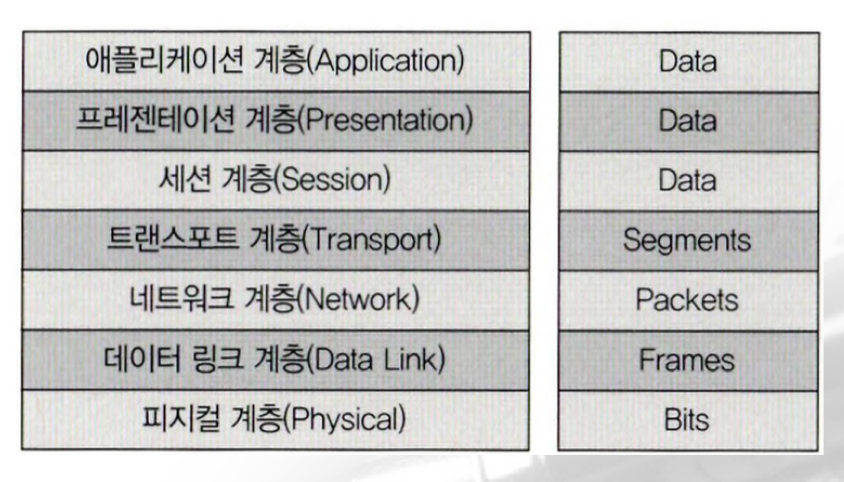
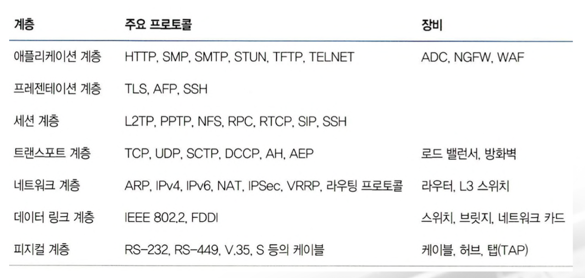

# Linux

## Shell Programming

### 8) 정규 표현식

- 문자 클래스
    - `[:digit:]`: 숫자, [0-9] 또는 \d
    - `[:lower:]`: 알파벳 소문자, [a-z]
    - `[:upper:]`: 알파벳 대문자, [A-Z]
    - `[:alpha:]`: 알파벳, [a-zA-Z]
    - `[:alnum:]`: 알파벳과 숫자 전체 [a-zA-Z0-9]
    - `[:xdigit:]`: 16진수 숫자
    - `[:space:]`: 공백문자(스페이스, 탭, 줄바꿈 등)
    - `[:blank:]`: 스페이스와 탭으로 줄바꿈이 빠짐
    - `[:punct:]`: 문장 부호 및 특수 문자
    - `[:print:]`: 출력 가능한 모든 문자 (공백 포함)
    - `[:graph:]`: 공백을 제외한 눈에 보이는 모든 문자
    - `[:cntrl:]`: 제어 문자(화면에 보이지 않는 문자)

- 실습
    - C로 시작해서 U로 끝나는 3글자
        - `grep C.U expression.txt`
    - C로 시작해서 e로 끝나는 4글자
        - `grep C..e expression.txt`
    - q로 시작하고 ?로 끝나는 단어인데 영문 소문자가 개수에 상관없이 존재하는 것을 검색
        - `grep q[a-z]*\? expression.txt`
        - `grep q[[:lower:]]*\? expression.txt`

    - - 다음에 숫자 2가 1번 이상 반복되고 -로 끝나는 단어 검색
        - `grep -E '\-2+\-' expression.txt`
    - #으로 시작하는 단어 검색
        - `grep ^# expression.txt`

    - 영문 5글자 뒤에 공백을 가진 단어 검색
        - `grep -E '^[a-zA-Z]{5}[[:space:]]' expression.txt`
    - 영문 5글자 이상 뒤에 공백을 가진 단어 검색
        - `grep -E '^[a-zA-Z]{5,}[[:space:]]' expression.txt`
    - 영문 4글자 이상 6글자 이하로 끝나는 단어 검색
        - `grep -E '[a-zA-Z]{4,6}$' expression.txt`
    - 숫자 4글자 이상 6글자 이하와 .으로 끝나는 단어 검색
        - `grep -E '[0-9]{4,6}.$' expression.txt`

# Network

## Network

### 1) 프로토콜

- 개요
    - 규정이나 규약과 관련된 내용
    - 네트워크에서 통신할 떄의 규칙이 프로토콜
    - 프로토콜은 어떤 표준 협회나 워킹 그룹이 만들었는지 또는 어떤 회사에서 사용하느냐에 따라 특징이 많이 달라지고 다양한 프로토콜이 존재
    - 최근에는 복잡하고 산재되어 있던 여러가지 프로토콜 기술이 `이더넷-TCP/IP` 기반 프로토콜들로 변경되고 있음
    - 물리적 측면: 데이터 전송 매체, 신호 규약, 회선 규격 등으로 이더넷이 널리 쓰임
    - 논리적 측면: 장치들끼리 통신하기 위한 프로토콜 규격으로 `TCP/IP`가 널리 쓰임
    - 적은 컴퓨팅 자원과 매우 느린 네트워크 속도를 이용해서 최대한 효율적으로 통신하는 것이 목표이다 보니 대부분의 프로토콜이 문자 기반이 아닌 2진수 비트 기반으로 만들어짐
    - 최소한의 비트로 내용을 전송하기 위해서는 치밀하게 서로 건의 약속을 정의해야함
    - 애플리케이션 레벨의 프로토콜은 비트 기반이 아닌 문자 기반 프로토콜이 많이 사용되고 있는데 HTTP가 대표적
    - 비트로 메시지를 전달하지 않고 문자 자체를 이용해 헤더와 헤더 값

### 2) OSI 7 계층

- 과거에는 통신용 규약이 표준화되지 않았고 각 벤더에서 별도로 개발했기 때문에 호환되지 않는 시스템이나 애플리케이션이 많았고 통신이 불가능했는데 이를 하나의 규약으로 통합하려는 노력이 현재의 OSI 7 계층
- OSI 계층이 네트워크 동작을 나누어 이해하고 개발하는데 많은 도움이 되므로 네트워크의 주요 래퍼런스 모델로 활용되고 있지만 최근에는 TCP/IP 프로토콜 스택 기반으로 되어있음

- 복잡한 데이터 전송 과정을 OSI 7계층으로 나누어 보면 이해하기가 쉬움

- OSI 7계층은 다시 2개 블럭으로 나눌 수 있음
    - 1~4계층: Data Flow Layer (하위 계층 - 기계)
    - 5~7계층: Application Layer (상위 계층 - 인간)

- Data Flow Layer는 데이터를 상대방에게 잘 전달하는 역할을 수행하는데 애플리케이션 개발자는 Application Layer 프로토콜을 개발하거나 이용할 때 Data Flow Layer는 고려하지 않고 데이터를 표현하는데 초점을 맞춤
- 애플리케이션 계층은 애플리케이션 개발자들이 고려해야 할 영역이고 네트워크 엔지니어는 애플리케이션 계층은 심각하게 고려하지 않음
- 애플리케이션 개발자는 하향식으로 네트워크 엔지니어는 상향식으로 네트워크를 인식

- __1계층 (physical layer)__
    - 물리적 연결과 관련된 정보를 정의
    - 전기 신호를 전달하는데 초점이 맞추어져 있음
    - 장비로는 Hub, Repeater, Cable, Connectrom Tranceiver, TAP(네트워크 모니터링과 패킷 분석을 위해 전기 신호를 다른 장비로 복제해주는 장비로 패킷을 복사해서 Wireshark, IDS, IPS, 패킷 분석기 등에 전달 - 원래 통신에는 아무런 영향도 주지 않음) 등이 있음
    - 1계층 장비는 들어온 전기 신호를 그대로 잘 전달하는 것이 목적이며 주소의 개념이 없으므로 전기 신호가 들어온 포트를 제외하고 모든 포트에 동일한 전기 신호를 전송

- __2계층(데이터 링크 계층)__
    - 전기 신호를 모아서 우리가 알아볼 수 있는 데이터 형태로 변환해주는 계층
    - 주소 정보를 정의하고 정확한 주소로 통신이 되도록 하는데 초점을 맞춤
    - 1계층에서는 전기 신호를 잘 보내는 것이 목적이라서 출발지와 목적지를 구분할 수 없지만 2계층에서는 출발지와 목적지 주소를 확인하고 내게 보낸 것이 맞는지 또는 내가 처리해야 하는지에 대해 검사한 후 데이터 처리를 수행
    - 전기 신호를 모아 데이터 형태로 처리하기 때문에 데이터에 대한 에러를 탐지하거나 고치는 역할을 수행
    - 이더넷 기반 네트워크에서는 에러를 탐지하는 역할만 수행
    - 주소 체계가 생긴다는 의미는 하나의 장비와만 통신하는 것이 아니라 동시에 여러 장비와 통신할 수 있다는 것으로 무작정 데이터를 전송하는 것이 아니라 받는 장비와 현재 데이터를 받을 수 있는지 확인하는 작업을 해야 하는데 이 역할을 `Flow Control` 이라고 한다.
    - 2계층에서 동작하는 네트워크 구성 요소는 `NIC(Network Interface Card - 랜카드)` 와 `Switch`
    - 가장 중요한 특징은 `MAC` 주소라는 주소 체계가 있다는 것
    - 2계층에서 동작하는 `NIC`와 `Switch` 는 모두 MAC 주소를 이해할 수 있고 `Switch`는 MAC 주소를 보고 통신해야할 포트를 지정해 내보내는 능력이 있음
    - `NIC`의 동작
        - 전기 신호를 데이터 형태로 생성
        - 목적지 MAC 주소와 출발지 MAC 주소를 확인
        - 네트워크 인터페이스 카드의 MAC 주소를 확인
        - 목적지 MAC 주소와 네트워크 인터페이스 카드가 갖고 있는 MAC 주소가 일치하면 데이터를 처리하고 다르면 데이터를 폐기
    - `Switch`의 동작
        - 단말이 어떤 MAC 주소인지 연결된 포트는 어느 것인지 주소를 학습할 수 있음
        - 학습한 주소를 기반으로 해서 단말들이 통신을 할 때 적절히 필터링하고 정확한 포트로 포워딩(출발지 주소를 변경하지 않고 전송) 해줌
        - 허브는 한 포트에서 전기 신호가 들어오면 전체 포트로 전기 신호를 전달하다 보니 전체 네트워크에서 동시에 오직 하나의 장비만 데이터를 보낼 수 있음
        - 스위치는 적절한 필터링과 포워딩 기능으로 통신이 필요한 포트만 사용하고 네트워크 전체에 불필요한 처리가 감소하면서 네트워크 효율성이 향상되었고 이더넷 기반 네트워크가 급증하는 계기가 됨

- __3계층(network layer)__
    - IP 주소와 같은 논리적인 주소를 정의
    - 데이터 통신을 할 때는 두 가지 주소가 사용되는데 2계층의 물리적인 MAC 주소와 3계층의 논리적인 IP 주소
    - IP 주소는 사용자가 환경에 맞게 변경해 사용할 수 있음
    - IP 주소는 네트워크 주소 부분과 호스트 주소 부분으로 나눔
    - 3계층을 이해할 수 있는 장비나 단말은 네트워크 주소 정보를 이용해서 자신이 속한 네트워크와 원격지 네트워크를 구분할 수 있고 원격지 네트워크를 가려면 어디로 가야하는지 경로를 지정할 수 있음
    - 3계층에서 동작하는 장비가 라우터
    - 라우터는 IP 주소를 사용해서 최적의 경로를 찾아주고 해당 경로로 패킷을 전송하는 역할을 수행

- __4계층(transport layer)__
    - 데이터들이 정상적으로 잘 보내지도록 확인하는 역할을 수행
    - 패킷 네트워크는 데이터를 분할해서 패킷 단위로 전송을 하게 되는데 중간에 패킷이 유실되거나 순서가 바뀌는 경우가 있는데 이 문제를 해결하기 위해서 존재하는 계층이 4계층
    - 패킷에 보내는 순서를 명시한 것이 `Sequence Number` 이고 받는 순서를 명시한 것이 `ACK(Acknowledge Number)`
    - 장치 내의 애플리케이션을 구분할 수 있도록 포트 번호를 사용
    - 4계층에서 동작하는 장비는 **로드 밸런서**와 **방화벽**이 있는데 포트 번호와 시퀀스 번호 그리고 ACK를 이용해서 부하를 분산하거나 보안 정책을 수립해 패킷을 통과 및 차단하는 기능을 수행

- __5계층(session layer)__
    - 양쪽 끝 단의 응용 프로세스가 연결을 성립하도록 도와주고 연결이 안정적으로 유지되도록 관리하고 작업 완료되면 연결을 끊는 역할을 수행
    - TCP/IP 세션을 만들고 없애는 에러로 중단된 통신에 대한 에러 복구와 재전송도 수행

- __6계층(presentation layer)__
    - 표현 방식이 다른 애플리케이션이나 시스템 간의 통신을 돕기 위해서 하나의 통일된 구문 형식으로 변환시키는 기능을 수행
    - 번역기나 변환기의 역할을 수행하는 계층이고 이런 기능은 사용자 시스템의 응용 계층에서 데이터의 형식 상 차이를 다루는 부담을 줄여줌

- __7계층__
    - 네트워크 소프트웨어의 UI 부분이나 사용자 입출력 부분을 정의

- 계층별 프로토콜과 장비

- ADC(Application Delivery Controller - 고성능로드밸런서 + 애플리케이션 최적화 장비)
- NGFW(Next Generation Firewall - 애플리케이션 분석, IPS, IDS 등의 기능을 수행)
- WAF(Web Application firewall - HTTP 나 HTTPS 를 분석해서 웹 공격을 차단)

### 3) TCP/IP 프로토콜 스택

- 현대 네트워크는 TCP/IP 프로토콜과 이더넷으로 이루어져 있음
- 일부 특수한 환경에서는 다른 프로토콜이 사용되기도 하지만 다양한 기술과 프로토콜 중 어느 것을 선택헤야 할 지 고민하던 과거와는 상황이 매우 다름
    - NVIDIA GPU 는 TCP/IP 프로토콜에 속하지 않은 NVLink 나 NVSwitch 라는 프로토콜을 사용
- 기술과 표준을 만들 때 만들어진 역사적 배경이나 만든 조직 또는 프로토콜이 만들어진 목표에 따라 성향이 많이 반영되는데 TCP/IP는 이론보다 실용성에 중점을 둔 프로토콜 스택

- TCP/IP 모델은 4계층으로 구분

### 4) Encapsulation & Decapsulation

- 상위 계층에서 하위 계층으로 데이터를 보내면 물리 계층에서 전기 신호로 변경해서 네트워크를 통해 신호를 보내고 받는 쪽에서는 하위 계층에서 상위 계층으로 전송을 하게 되는데 데이터를 보내는 것을 Encapsulation 이라고 하고 반대 방향을 Decapsulation

- 패킷 기반 네트워크 
    - 현대 네트워크는 대부분 패킷 기반 네트워크
    - 패킷 네트워크는 데이터를 패킷이라는 작은 단위로 쪼개서 보내는데 이렇게 쪼개서 보내는 이유는 하나의 통신이 회선 전체를 점유하지 않고 동시에 여러 단말이 통신을 할 수 있도록 하기 위해서

- 데이터 전송
    - 보내는 쪽에서는 상위 계층 프로토콜을 이용해서 데이터를 생성
    - 트랜스포트 계층에서 4계층 헤더를 추가(port 번호)해서 3계층으로 전달
    - 네트워크 계층에서는 받은 데이터(Segment)에 3계층 헤더를 추가(IP 주소)해서 2계층으로 전달
    - 데이터 링크 계층에서는 네트워크 계층에서 받은 데이터(Packet)에 2계층 헤더(MAC Address)를 추가해서 물리 계층으로 전달
    - 물리 계층에서는 전기 신허로 변경해서 목적지로 전송

    - 받는 쪽에서는 물리 계층에서 데이터를 변환해서 데이터 링크 계층으로 전송
    - 데이터 링크 계층에서 2계층 헤더를 제거하고 네트워크 계층으로 전송
    - 네트워크 계층에서는 3계층 헤더를 제거하고 트랜스포트 계층으로 전송
    - 트랜스포트 계층에서는 4계층 헤더를 제거하고 애플리케이션 계층으로 전송해서 데이터를 해석

- `MSS & MTU`
    - 애플리케이션에서 데이터를 만들어 보낼 때 하위 계층에서 네트워크 상황에 맞게 데이터를 쪼개서 전달
    - 네트워크에서 수용할 수 있는 크기를 역산정해서 데이터가 4계층으로 내려올 때 적절한 크기로 쪼개질 수 있도록 유도하는데 이 값을 `MSS(Maximum Segment Size)`
    - 네트워크에서 한 번에 보낼 수 있는 데이터 크기를 MTU(Maximum Transmission Unit) 라고 하며 일반적인 이더넷에서는 1500바이트
        - 3계층과 4계층 헤더의 크기가 각각 20바이트이므로 1460바이트가 MSS

## 네트워크 연결과 구성 요소

### 1) 네트워크 규모에 따른 분류

- 종류
    - `LAN(Local Area Network)`: 작은 사무실이나 건물 정도의 내부 네트워크
    - `MAN(Metro Area Network)`: 한 도시 정도를 연결하고 관리하는 네트워크
    - `WAN(Wide Area Network)`: 멀리 떨어진 LAN을 연결해주는 네트워크

- 예전에 LAN과 MAN 그리고 WAN에서 사용하는 기술이 모두 달라서 사용하는 프로토콜이나 전송 기술에 따라 구분할 수 있었는데 현재는 대부분의 기술이 이더넷으로 통합되면서 관리 범위 기준으로 LAN, WAN을 구분

- MAN 과 WAN 의 구분은 자체 인프라를 이용해서 구축을 하면 MAN이라고 보고 통신사가 가지고 있는 인프라를 이용하면 WAN

- `LAN`
    - 비교적 소규모의 네트워크
    - 스위치와 같이 간단한 장비로 연결
    - 예전에는 다양한 기술이 사용이 되었지만 최근에는 이더넷 기반 전송 기술을 사용
    - 자신이 소유한 건물이나 대지에 직접 구축한 선로로 동작시키는 네트워크

- `WAN`
    - 먼 거리에 있는 네트워크를 연결
    - 멀리 떨어진 LAN을 서로 연결하거나 인터넷에 접속하기 위한 네트워크가 WAN
    - 특별한 경우가 아니면 직접 구축할 수 없는 범위의 네트워크이므로 통신사업자로부터 회선을 임대해서 사용

### 2) 네트워크 회선

- 일반적인 인터넷 회선
    - 인터넷 접속을 위해 통신 사업자와 연결하는 회선
    - 가입자와 통신 사업자 간에 직접 연결되는 구조가 아니라 전송 선로 공유 기술을 이용(Multiplexing)
    - 내부 선로가 직접 연결되는 구조여서 인터넷 전용 회선처럼 보이지만 통신 사업자끼리 연결한 회선을 공유하는 구조
    - 인터넷 회선의 속도는 전송 가능한 최대 속도이고 전용 회선과 달리 그 속도를 보장하지 않음

- 전용 회선
    - 가입자와 통신 사업자 간에 대역폭을 보장해주는 서비스
    - 대역폭을 보장해주는 기술 중 하나가 TDM(time Division Multiplexing - 시분할 다중화)
    - 전용 회선은 저속과 고속으로 구분하기도 한다.
    - `LLCF(Link Loss Carry Forward)`
        - 한 쪽 링크가 다운되면 이를 감지헤서 반대쪽 링크도 다운시키는 기능

- 인터넷 전용 회선: 인터넷 연결 회선에 통신 대역폭을 보장해주는 것

- `VPN`
    - 개요
        - Virtual Private Network 의 약자로 물리적으로 전용선이 아니지만 가상으로 직접 연결한 것 같은 효과가 나도록 만들어주는 기술
        - 여러가지 방법으로 구현되고 가입자 입장에서의 기술과 통신 사업자 입장에서의 기술이 별도로 발전

    - 통신 사업자 VPN
        - 전용선은 연결 거리가 늘어날 수록 비용이 증가
        - 전용선은 사용 가능한 대역폭을 보장해주지만 가입자가 계약된 대역폭을 항상 100% 사용하는 것은 아니라서 낭비되는 비용이 클 수 있고 먼 거리를 연결하더라도 비용을 줄이기 위해서 통신 사업자가 직접 가입자를 구분해서 사용할 수 있는 VPN을 이용하는데 이 방식 중 하나가 MPLS VPN
    - MPLS VPN
        - 여러 가입자가 하나의 MPLS 망에 접속이 되지만 가입자를 구분할 수 있는 기술을 적용해서 전용선처럼 사용하는 것

    - 가입자 VPN
        - 비용을 줄이기 위해서 일반 인터넷 망을 이용하는 방식

### 3) 네트워크 구성 요소

- `NIC(Network Interface Card)`
    - 컴퓨터를 네트워크에 연결하기 위한 하드웨어 장치
    - 온보드 형태로 네트워크 인터페이스 카드가 장착되어 있어서 실제로 장착하는 경우는 드묾
    - 역할
        - **직렬화(Serialization)**
            - 전기적 신호를 데이터 신호 형태로 또는 데이터 신호 형태를 전기적 신호 형태로 변화해주는 역할
        - **MAC Address**
            - 고유의 물리적인 주소
        - **Flow Control(흐름 제어)**: 속도 조절(이미 처리 중인 데이터 때문에 새로운 데이터를 받지 못하는 상황을 예방하기 위해서 데이터를 받지 못하는 상황을 상대방에 알려서 통신 중지를 요청)

- `케이블과 커넥터`
    - 케이블 규격
        - 속도 채널 타입 / 속도 채널 타입
        - 1000BASE-T/10GBASE-T: 속도는 1000Mbps 이고 트위스트 페어 케이블을 이용하는 이더넷 표준
        - 1000BASE-SX/10GBASE-SR: 속도는 1000Mbps 이고 광 케이블을 이용하는 이더넷 표준

- `Hub`
    - 케이블과 동일한 1계층 장비
    - 거리가 멀어질 수록 줄어드는 전기 신호를 재생성 해주는 역할
    - 여러 대의 장비를 연결
    - 허브는 단순히 들어온 신호를 모든 포트로 내보내(브로드캐스팅) 네트워크에 접속된 모든 단말이 경쟁하게 되므로 전체 네트워크 성능이 줄어드는 문제가 있고 패킷이 무한 순환해서 네트워크 전체를 마비시키는 루프와 같은 다양한 장애 원인이 되므로 유의

- `Switch`
    - 허브와 동일하게 여러 장비를 연결하고 통신을 중재하는 2계층 장비
    - 허브의 역할을 수행하기 때문에 Switching Hub 라고도 함
    - MAC 주소를 이해할 수 있어서 한 번 데이터를 전송한 포트의 연결된 장비의 MAC 주소를 학습해서 다음에 다른 포트에서 이 장비에게 전달을 할 때 브로드캐스팅을 하지 않고 유니캐스트(1:1로 전송)을 수행

- `Router`
    - 내부 네트워크가 아닌 다른 네트워크와 통신을 할 수 있도록 해주는 3계층 장비

- `Load Balancer`
    - OSI 4계층에서 동작하는 장비인데 최근에는 7계층에서 동작(Application Delivery Controller) 하는 것도 있음
    - 4계층 포트 주소를 확인하는 동시에 IP 주소를 변경할 수 있음
    - 여러 대의 동일한 기능을 수행하는 서버들을 연결하고 요청이 왔을 때 IP 주소 변경을 통해서 부하를 분산하는 장비

- `보안 장비`
    - 네트워크 장비의 대부분은 정확한 정보 전달이 목적이지만 보안 장비는 네트워크 장비와 달리 정보를 잘 제어하고 공격을 방허나느데 초점을 맞춤
    - 방어 목적과 보안 장비가 설치되는 위치에 따라 다양한 형태로 구분
    - 대표적인 보안 장비가 방화벽인데 방화벽은 OSI 7계층 중에서 4계층에서 동작해서 방화벽을 통과하는 패킷의 3, 4계층 정보(IP, Port)를 확인하고 패킷을 정책 비교해서 버리거나 포워딩하는 장비

- `공유기`
    - 2계층 스위치, 3계층 라우터, 4계층 NAT 와 같은 간단한 방화벽 기능을 한 곳에 모아놓은 장비
    - 공유기 내부는 스위치 부분 그리고 무선 부분과 라우터 회로 부분으로 나눔
    - 간단한 장비처럼 보이지만 내부적으로는 크게 스위치와 무선 AP, 라우터 부분으로 구분되는 복잡한 장비

- `모뎀`
    - 먼거리 통신이 가능하도록 하는 장비
    - 짧은 거리를 통신하는 기술과 먼 거리를 통신할 수 있는 기술이 달라서 이 기술들을 변환해주는 장비

## 네트워크 통신

### 1) 수신자의 범위에 따른 분류

- 종류 - 목적지의 Address를 기준으로 구분
    - `Unicast`
        - 1:1 통신
        - 출발지와 목적지가 1:1로 통신
        - 실제 사용하는 대다수의 통신
    - `Broadcast`
        - 동일 네트워크에 존재하는 모든 호스트가 목적지
        - 목적지 Address가 네트워크 전체로 표기되어 있는 방식으로 Unicast로 통신하기 전에 상대방의 정확한 위치를 알기 위해 사용
    - `Multicast`
        - 1:그룹(Multicast를 구독 호스트) 통신
        - 하나의 출발지에서 다수의 특정 목적지로 데이터를 전송
        - Multicast 그룹 Address를 이용해서 해당 그룹에 속한 다수의 호스트로 패킷을 전송하기 위한 통신 방식
        - IPTV 나 사내 방송 또는 증권 시세 방송처럼 단방향으로 다수에게 동시에 같은 내용을 전달할 때 사용
    - `Anycast`
        - 1:1 통신(목적지는 동일 그룹 내의 1개 호스트)
        - 다수의 동일 그룹 중 가까운 호스트에서 응답
        - IPv4에서는 일부 기능 구현
        - IPv6에서는 모든 구현 가능
        - Anycast Address가 같은 호스트 중에서 가장 가깝거나 가장 효율적으로 서비스 할 수 있는 호스트와 통신하는 방식
        - 가장 가까운 DNS 서버를 찾을 때 사용
        - 최종 통신은 1:1 와 Unicast Anycast가 동일하지만 통신할 수 있는 후보자는 서로 다른데 Unicast 는 출발지와 목적지가 모두 하나씩이지만 Anycast는 같은 목적지 Address를 가진 서버가 여러 대여서 통신 가능한 다수의 후보군이 존재
        - 현재 주로 사용하는 네트워크 주소 체계는 IPv4이며 일부 모바일 네트워크와 데이터 센터 위주로 새로운 IPv6 기반 주소 체계가 사용되고 있으며 IPv6에서는 Broadcast가 존재하지 않고 링크 로컬 Multicast로 대체

- 링크 로컬 멀티캐스트
    - 개요
        - 같은 물리적 네트워크 안에 있는 특정 그룹의 장치들에만 데이터를 전송
        - 링크 로컬은 라우터를 넘어가지 않는 동일한 로컬 네트워크 내로 범위를 한정한다는 의미
    - 특징
        - 범위 제한: 데이터가 라우터를 통과하지 못하므로 오직 같은 스위치나 허브에 연결된 장치들끼리만 통신이 가능
        - 네트워크 상의 장치들이 서로를 찾거나 자동으로 설정을 주고받을 때 사용
        - Broadcast 와 달리 해당 데이터를 받기로 설정된 그룹 멤버들에게만 전달되어 불필요한 트래픽을 줄임
    - 사용 사례
        - IPv6에서는 Broadcast가 존재하지 않기 때문에 링크 로컬 Multicast를 이용해서 구현
        - Address 자동 설정(SLAAC): 장치가 네트워크에 접속하자마자 자신의 존재를 알리거나 중복 주소를 확인할 때 사용
        - 인근 장치 탐색(Neighbor Discovery): IPv4의 ARP 대신 상대방의 MAC Address를 알아내기 위해서 Multicast 메시지를 보냄

- `BUM Traffic`
    - BUM 은 B(Broadcast), U(Unknown Unicast), M(Multicast)인데 서로 다른 트래픽이지만 네트워크에서의 동작은 유사
    - Unknown Unicast는 목적지 Address가 명확히 명시되어 있지만 네트워크에서의 동작은 Broadcast 와 유사한데 목적지에 대한 Address를 학습하지 못했기 때문에 스위치 입장에서는 패킷을 모든 포트로 플러딩하는데 이런 Unicast 가 Unknown Unicast

    - BUM 트래픽이 많아지면 네트워크 성능이 저하될 수 있음
    - 이더넷 환경에서는 ARP Broadcast를 먼저 보내고 이후 통신을 시작하므로 BUM 트래픽이 많이 발생하지 않음

### 2) MAC Address

- 개요
    - 변경할 수 없도록 하드웨어 고정돼서 출하되는 주소
    - 하드웨어마다 서로 다른 유일한 주소
    - 모든 네트워크 장비 업체에서 장비가 출하될 때마다 MAC Address를 할당하게 되는데 매번 이 Address의 할당 여부를 확인할 수 없기 때문에 한 제조업체에 하나 이상의 Address 풀을 주고 그 풀 안에서 각 제조업체가 자체적으로 MAC Address를 할당
    - 네트워크 장비 업체에 Address 풀을 할당하는 것을 제조사코드라고 하며 국제기구 중 하나인 IEEE에서 관리
    - MAC Address는 48비트이고 16진수 12자리로 표현
    - 앞의 24비트를 OUI라고 하는데 이는 제조사 코드이고 뒤의 24비트는 UAA라고 하고 각 제조사에서 자체적으로 할당하여 네트워크에서 각 장비를 구분

- 유일하지 않은 MAC Address
    - 네트워크 장비 제조사에서 UAA 값을 할당하는데 실수나 의도적으로 MAC Address가 중복될 수 있음
    - 동일 네트워크에서만 중복되지 않으면 통신하는데는 아무런 문제가 없음
    - 네트워크 통신을 할 때 네트워크가 달라서 라우터의 도움을 받아야 할 경우 라우터에서 다른 네트워크로 넘겨줄 때 출발지와 목적지 MAC Address가 변경되므로 네트워크를 넘어가면 기존 출발지와 도착지 MAC Address를 유지하지 않음

- MAC Address 변경
    - 일반적으로 ROM 형태로 고정되어 출하되므로 NIC에 고정된 MAC Address를 변경하기는 어렵지만 결국 이 주소도 메모리에 적재되어 구동이 되므로 여러가지 방법을 이용해서 변경된 주소로 NIC를 동작시킬 수 있음
    - 윈도우에서는 Driver 상세 정보에서 MAC Address 변경을 제공하기 때문에 쉽게 변경 가능
    - 리눅스는 GNU MacChanger나 각 리눅스 배포판의 네트워크 설정 파일에 MAC Address를 입력하면 Address 변경이 가능

