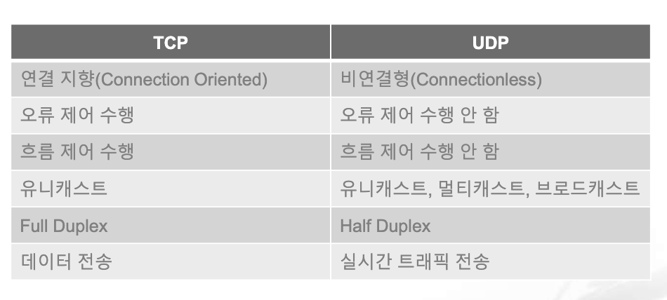

# Network

## 네트워크 통신

### 2) MAC Address

- **동작**
    - 기본 동작 방식
        - NIC는 자신의 MAC Address를 가지고 있고 전기 신호가 들어오면 2계층에서 데이터 형태로 변환해서 내용을 구분한 후 도착지 MAC Address를 확인
        - 도착지 Address가 자신의 MAC Address 와 일치하지 않으면 그 패킷을 폐기
        - 패킷의 목적지 Address 가 자기 자신이거나 Broadcast, Multicast 와 같은 그룹 Address 이면 처리해야 할 Address 로 인지해서 패킷 정보를 상위 계층으로 넘김
        - 도착지 Address가 일치하지 않아 NIC에서 자체적으로 패킷을 폐기하는 경우와 달리 본인의 Address, Broadcast Address는 NIC 자체적으로 패킷을 처리하는 것이 아니라 OS나 애플리케이션에서 처리

        - OS나 애플리케이션에서 데이터 폐기를 하게 되면 시스템에 부하가 작용

    - `무차별 모드(Promiscuous Mode)`
        - 네트워크 상태를 모니터링 하거나 디버그 또는 분석 용도로 사용하고자 하는 경우 NIC가 정상적으로 동작하면 다른 목적지를 가진 패킷을 분석할 수 없음
        - 다른 목적지를 가진 패킷을 분석하거나 수집해야 할 경우 무차별 모드로 NIC를 구성
        - 무차별 모드는 자신의 MAC Address 와 상관없는 패킷이 들어와도 이를 분석할 수 있도록 메모리에 올려 처리할 수 있게 함
        - 대표적인 애플리케이션이 Wireshark 와 Packet Tracer 등

    - MAC Address를 여러 개 갖는 경우
        - MAC Address는 단말에 종속되지 않고 NIC에 종속되므로 단말에 여러 개의 NIC를 장착하면 여러 개의 MAC Address를 가질 수 있음
        - 멀티 레이어 스위치, 라우터와 같은 장비는 NIC가 여러 개이므로 여러 개의 MAC Address도 여러 개가 할당됨

### 3) IP Address

- **개요**
    - OSI 7계층에서 Address를 갖는 계층은 2계층과 3계층
    - 2계층은 논리 Address인 `IP Address`를 사용
    - 사용자가 변경 가능한 논리 Address
    - 2 부분으로 나누는데 그룹을 의미하는 `Network Address` 와 구별하기 위한 `Host Address`
- **주소 체계**
    - IPv4는 32비트 주소 체계이고 IPv6는 128비트 체계
    - IPv4는 4개의 옥텟(8비트)로 나누고 각 옥텟은 .으로 구분해서 10진수(0~255)로 나타냄
    - IPv4는 네트워크 주소와 호스트 주소로 구분하는데 크기를 설정하는 것이 가능

- **IPv4 Classful**
    - 필요한 호스트 IP 개수에 따라 네트워크 크기를 다르게 할 수 있는 클래스 개념을 도입
    - A, B, C, D, E 5개의 클래스로 구분
    - `A Class`: 0.0.0.0 ~ 127.255.255.255
        - 호스트 개수가 256 * 256 * 256
        - 0.0.0.0/8
        - 1.0.0.0/8
    - `B Class`: 128.0.0.0 ~ 191.255.255.255
        - 호스트 개수가 256 * 256
        - 128.0.0.0/16
        - 128.1.0.0/16
    - `C Class`: 192.0.0.0 ~ 223.255.255.255
        - 호스트 개수가 256
        - 192.0.0.0/24
        - 192.0.1.0/24

    - `D Class`: 224.0.0.0 ~ 239.255.255.255
        - Multicast 용
    - `E Class`: 240.0.0.0 ~ 255.255.255.255
        - 예비

- **서브넷 마스크**
    - 네트워크의 규모를 나타내기 위한 표현법
    - 동일한 주소를 사용하는 영역을 1로 표시해서 비트 수나 IPv4 주소 형태로 표현
        - `192.168.0.0./24` 또는 `192.168.0.0. 255.255.255.0` 의 형태로 표현
        - 위 네트워크의 의미는 192.168.0까지 동일하면 같은 네트워크로 간주
    - 이 크기가 주소 대역 별로 고정되어 있는 방식을 `Classful` 이라고 한다.
    - 0과 1을 반대로 치환해서 사용하는 것을 `와일드 마스크`라고 한다.
    - 와일드 마스크는 방화벽에서 사용

- **IP 주소 부족**
    - 인터넷이 상용화가 되면서 인터넷에 연결되는 호스트 숫자가 폭발적으로 증가
    - 기본 Classful 방식으로는 주소를 감당할 수 없음
    - 해결책
        - `CIDR(Classless Inter Domain Routing)` 기반의 Address 체계
        - `NAT` 와 `private IP Address`
        - `IPv6`

- **CIDR**
    - 등장
        - IPv4의 주소 부족 문제를 해결하기 위해서 등장
        - Classful을 이용하면 IP 주소가 낭비
        - 서브넷 마스크의 크기를 자유롭게 사용
    - 서브네팅과 슈퍼 네팅(Route Summarization)
        - 서브네팅은 기본 Classful 방식의 네트워크를 분할해서 사용하는 것
        - 슈퍼네팅은 기본 Classful 방식의 네트워크를 병합해서 사용하는 것인데 라우터에서 네트워크를 병합해서 광고를 하기 위해서 주로 사용
        - 192.168.200.2 ~ 192.168.203.254 안에서 할당
        - 서브넷 마스크는 아이피 대역을 보고 자동으로 설정이 된다.
        - C 클래스 주소라서 255.255.255.0 이 자동으로 설정되는데 현재는 255.255.252.0 으로 설정
        - 255.255.255.0 으로 해도 인터넷을 하는데는 아무런 지장이 없음
        - 192.168.200.100/22 을 할당하고 다른 분은 192.168.201.101/24 로 한 경우 이 두 곳은 내부 통신을 할 수 없다.
        - 기본 게이트웨이를 192.168.201.1 로 설정하면 인터넷을 할 수 없음

    - 실무에서 고려해야 할 부분
        - 네트워크 사용자 입장
            - 네트워크에서 사용할 수 있는 IP 범위 파악
            - 기본 게이트웨이와 서브넷 마스크 설정이 제대로 되어 있느지 확인
        - 네트워크 설계자 입장: 네트워크 설계 시 네트워크 내에 필요한 단말을 고려한 네트워크 범위 설계

- **Public IP 와 Private IP**
    - 외부와 통신을 하려면 IP Address 가 있어야 한다.
    - IP Address는 네트워크 내에서는 유일무이 해야 한다.
    - 인터넷을 하고자 할 때는 전 세계 네트워크에서 유일무이한 주소를 사용해야 하는데 인터넷을 하지 않는 곳에서는 세계에서 유일무이한 IP 주소를 가질 필요가 없음
    - 내부 네트워크 구성을 위한 IP가 필요
    - 외부 네트워크에서 사용하지 않고 내부 네트워크에서만 사용 가능한 IP가 `Private IP`
    - `Private IP`를 사용하면 기본적으로 인터넷에 접속할 수 없지만 NAT 장비를 이용하면 접속이 가능
    - `Private IP` 대역
        - 10.0.0.0/8: 10.0.0.0 ~ 10.255.255.255
        - 172.16.0.0/12: 172.16.0.0 ~ 172.31.255.255
        - 192.168.0.0/16: 192.168.0.0 ~ 192.168.255.255
    - IP 공유기에서는 192.168.0.0/24 를 주로 이용하고 모바일 디바이스는 10. 대역이나 172.16 대역을 주로 이용한다.
    - `Bogon IP`
        - IP 주소를 할당하는 최상위 기구인 IANA 가 여러가지 목적으로 예약해서 Public IP로 할당되지 않는 IP
        - 인터넷에서 동작하는 라우터에 해당 IP 정보가 없음
        - Bogon IP로 통신 시도가 있었다면 해킹을 목적으로 IP Spoofing(IP 주소 변조) 했거나 실수로 할당된 IP를 사용한 경우이므로 적절히 필터링 하는 것이 좋음
        - 0.0.0.0/8: This network
        - 10.0.0.0/8: Private Network
        - 10.64.0.0/10: 통신 사업자가 Private IP를 할당하기 위해서 사용
        - 127.0.0.0/8: Loopback 주소
        - 127.0.53.53: 네임 충돌 발생
        - 169.254.0.0/16: Link Local
        - 172.16.0.0/12: Private Network
        - 192.0.0.0/24: IETF 프로토콜 할당
        - 192.0.2.0/24: 테스트 용
        - 192.168.0.0/16: Private Network
        - 192.168.0.0/15: 네트워크 인터커넥트 디바이스 벤치마크 테스트용
        - 198.51.100.0/24: 테스트 용
        - 203.0.113.0/24: 테스트 용
        - 224.0.0.0/4: 멀티 캐스트 용
        - 240.0.0.0/24: 예약
        - 255.255.255.255/32: 브로드캐스트

    - IP 주소 발신지 확인 방법
        - IP Address를 보고 발신자의 신원이나 소속된 조직 이름을 알 수 있음
        - Whois 나 KISA에서 서비스를 제공

### 4) TCP & UDP

- **4계층 프로토콜과 서비스 포트**
    - 개요
        - 4계층에서는 `Sequence Number`, `ACK Number` 등이 사용됨
        - 2계층에서는 이더 타입, 그리고 3계층은 프로토콜 번호, 4계층은 포트 번호가 상위 프로토콜 지시자

        - TCP/IP 스택에서는 TCP 와 UDP가 담당
        - 4계층의 목적은 목적지를 찾아가는 주소가 아니라 애플리케이션에서 사용하는 프로세스를 정확히 찾아가고 데이터를 분할한 패킷을 잘 쪼개보내고 잘 조립하는 것
        - 실제로 통신을 할 때는 목적지에도 포트 번호가 설정되고 출발지에서도 포트 번호가 설정되는데 일반적으로 이야기하는 포트는 목적지의 포트 번호
        - 포트 번호 중 HTTP TCP 는 80, HTTPS TCP는 443, SMTP TCP는 25와 같이 잘 알려진 포트를 **Well Known 포트**라고 하는데 IANA에 등록하는데 1023 이하의 번호를 사용
        - 다양한 애플리케이션에 포트 번호를 할당하기 위해 Registered Port 범위를 사용하는데 1024 ~ 49151 의 범위이며 포트를 할당받기 위해 신청하면 아무 포트 번호나 할당
        - 동적으로 동작하는 Private 임시 포트의 경우 49152 ~ 65535 까지인데 이 포트 번호는 자동 할당되거나 시설 용도로 할당되고 클라이언트의 임시 포트 번호로 사용
        - k8s에서는 30000 ~ 32767 까지의 번호를 node port 라고 별도의 용도로 할당

- **TCP 프로토콜**
    - 개요
        - 연결지향 전송 계층 프로토콜
        - HTTP/HTTPS, SSH, SMTP, FTP, 데이터베이스 연결 등 신뢰성이 중요한 대부분의 통신에서 사용
    - 패킷 순서 & 응답 번호
        - ACK
            - 분할된 패킷을 잘 분할하고 수신 측이 잘 조합하도록 패킷에 순서를 주고 응답 번호를 부여
            - 패킷에 순서를 부여하는 것이 `시퀀스 번호`이고 응답 번호를 부여하는 것이 `ACK`
            - 이 번호를 확인해서 순서가 바뀌거나 중간에 패킷이 손실된 것을 파악할 수 있다.

    - 윈도우 사이즈와 슬라이딩 윈도우
        - TCP에서 패킷을 하나씩 주고 받아서 검사하면 오버헤드가 크기 때문에 한 번에 여러 개의 패킷을 보내고 ACK를 받는 방법을 선택할 수 있다.
        - 한 번에 보내는 패킷의 개수를 `윈도우 사이즈`라고 한다.
        - 여러 개의 데이터를 한꺼번에 전송하는 방식을 `슬라이딩 윈도우`라고 한다.
        - 슬라이딩 윈도우를 구현하는 방법도 여러가지가 있는데 정적으로 크기를 정하는 방식과 에러 발생 여부에 따라 동적으로 크기를 변경하는 방식이 있다.

- **UDP 프로토콜**
    - 4계층 프로토콜이 가져야 하는 특징이 거의 없음
    - TCP에서는 신뢰성 있는 통신을 위해서 연결을 미리 확립하고 데이터를 잘 분할하고 조립하기 위해 패킷 번호를 부여하고 수신된 데이터에 대해 응답하는 작업을 수행하기 때문에 데이터 유실이 발생하거나 순서가 변경되어도 바로 잡을 수 있지만 UDP에는 이런 기능이 없음
    - `UDP`의 헤더에는 시퀀스 번호, ACK번호, 윈도우 사이즈, 플래그가 없다.
    - 데이터 통신에서는 신뢰성이 핵심
    - `UDP`는 데이터 전송을 보장하지 않는 프로토콜이므로 제한된 용도로만 사용
    - 음성 데이터나 실시간 스트리밍과 같이 시간에 민감한 프로토콜이나 애플리케이션을 사용하는 경우 또는 사내 방송이나 증권 시세 데이터 전송에 사용되는 멀티캐스트처럼 단방향으로 다수의 단말과 통신해서 응답을 받기 어려운 환경에서 사용
    - 음성 및 동영상은 디지털 환경에서는 연속된 데이터가 아닌 매우 짧은 시간단위로 잘게 분할한 데이터가 전송되는 형태
    - 동영상은 1초 동안 30~60회 정도의 정지 영상이 빠르게 바뀌면서 우리 눈에는 마치 움직이는 영상처럼 보이는 원리를 이용하며 반대로 실세계 데이터를 디지털화 할 때는 시간을 잘게 쪼개 데이터를 샘플링하는데 이런 데이터들은 다른 일반 데이터처럼 취급하면 시간 지연에 따른 어려움이 있음

    - 중간에 데이터가 몇 개쯤 유실되는 것보다 재전송하기 위해 잠시 동영상이나 음성이 멈추는 것을 더 이상하게 느낄 수 있으므로 데이터를 전송하는데 신뢰성보다 일부 데이터가 유실되더라도 시간에 맞추어 계속 전송되는 것이 중요한 서비스의 경우 `UDP`를 사용
    - `UDP`는 중간에 데이터가 일부 유실되더라도 그냥 유실된 상태로 데이터를 처리
    - `UDP`는 TCP와 다르게 통신 시작하기 전 3방향 핸드셰이크와 같이 사전에 연결을 확립하는 절차가 없고 대신 첫 데이터는 리소스 확보를 위해 Interrupt를 거는 용도로 사용되고 유실되는데 UDP를 사용하는 애플리케이션이 대부분 이런 상황을 인지하고 동작하거나 연결 확립은 TCP 프로토콜을 사용하고 애플리케이션끼리 모든 준비를 마친 후 실제 데이터만 UDP를 이용하는 경우가 대부분
    - 동영상 전송 방식
        - 넷플릭스나 유튜브와 같이 시간에 민감하지 않은 단일 시청자를 위한 연결은 TCP를 사용

        - 원활한 시청을 위해 수 초~ 수 분의 동영상 데이터를 미리 받아놓고 네트워크에 잠시 문제가 발생하더라도 동영상이 끊기지 않도록 캐시에 저장
- TCP와 UDP 비교
  

### 5) ARP

- **개요**
    - OSI 7계층 중에서 2, 3계층이 주소를 가지고 있는데 실제 2계층과 3계층 주소 사이에는 아무런 관계가 없음 
    - MAC Address는 하드웨어 생산업체가 임의적으로 할당한 주소이고 NIC에 종속된 주소
    - 3계층 IP 주소는 우리가 직접 할당하거나 DHCP를 이용해 자동으로 할당
    - 일반적으로 통신은 IP 주소 기반으로 일어나고 MAC 주소는 상대방의 주소를 자동으로 알아내 통신하는데 상대방의 MAC 주소를 알아내기 위해 사용되는 프로토콜이 `ARP(Address Resolution Protocol)`
    - 데이터 통신을 위해 2계층 물리적 주소인 MAC 주소와 3계층 논리적 IP 주소 2개가 사용되는데 IP 주소 체계는 물리적 MAC 주소와 전혀 연관성이 없으므로 두 개의 주소를 연계시켜 주기 위한 매커니즘이 `ARP`
    - ARP는 TCP/IP 프로토콜 스택만을 위해서 동작하는 것은 아님
    - 아무런 통신이 없는 상태에서 처음 통신을 시도하면 패킷을 바로 캡슐화 할 수 없음
        - 통신을 시도할 때 출발지와 목적지 IP 주소는 미리 알고있어 캡슐화하는데 문제가 없지만 상대방의 MAC 주소를 알 수 없어 2계층 캡슐화를 할 수 없음
    - 상대방의 MAC 주소를 알아내려면 ARP 브로드캐스트를 이용해서 네트워크 전체에 상대방의 MAC 주소를 질의
        - 브로드캐스트를 받은 목적지들은 ARP 프로토콜을 이용해 자신의 MAC 주소를 응답하고 이 작업이 완료되면 캡슐화를 진행해서 상대방에게 데이터를 전송

    - 패킷 네트워크에서는 큰 데이터를 잘라 전송하므로 여러 개의 패킷을 전송해야 하는데 패킷을 보낼 때마다 ARP 브로드캐스트를 수행하면 네트워크 통신의 효율성이 크게 저하되므로 메모리에 이 정보를 테이블 형태로 저장해두고 재사용
    - `arp -a` 명령을 입력하면 PC의 ARP 테이블 정보를 확인할 수 있음
    - 성능 유지를 위해서는 ARP 테이블을 오래 유지하는 것이 좋지만 논리 주소는 언제든지 바뀔 수 있으므로 일정 시간 동안 통신이 없으면 이 테이블은 삭제
    - 패킷으로 데이터를 전송하는 네트워크에서는 데이터를 보내기 위해 여러 개의 패킷을 사용해야 하기 때문에 반복 작업을 줄이기 위해서 참조할 수 있는 여러가지 테이블을 사용하는데 DNS Cache 나 Routing Cache 들이 테이블을 사용
    - 네트워크 장비에서는 ARP 요청은 하드웨어 가속으로 처리하지 않고 CPU에서 직접 수행하기 때문에 짧은 시간에 많은 ARP 요청이 오면 네트워크 장비에서는 큰 부하로 작용
        - 해커들이 네트워크 장비를 공격할 때 ARP를 이용한 공격을 많이 수행했는데 네트워크 장비는 ARP 저장 기간을 일반 PC보다 길게 설정하고 많은 ARP 요청이 들어오면 이를 필터링하거나 천천히 처리하는 방식으로 네트워크 장비를 보호
    - 일부 장비는 ARP 테이블을 수동으로만 갱신하도록 설정해 운영하기도 함

- **GARP**
    - ARP의 대상자 IP 필드에 자신의 IP 주소를 채워서 ARP 요청을 보내는 것
    - Gratuitous ARP인데 자신의 IP 주소와 MAC Address를 알리는 것이 목적

    - 용도
        - IP 주소 충돌 감지
        - 상대방의 ARP 테이블을 갱신
        - HA(고가용성) 용도의 클러스터링

- **RARP**
    - `Reverse ARP`
    - ARP는 IP는 알고 있는데 MAC Address 를 몰라서 문의를 하는 것인데 나 자신의 MAC Address는 아는데 자신의 IP 주소가 없어서 어떤 IP 주소를 써야 하는지 서버에게 물어볼 때 사용
    - 과거에 네트워크 호스트의 주소 할당에 사용되었지만 제한된 기능으로 인해서 BOOTP와 DHCP로 대체 되어서 지금은 거의 사용되지 않음

### 6) Subnet & Gateway

- **게이트웨이**
    - 원격 네트워크 통신은 네트워크를 넘어 전달할 수 없는 브로드캐스트의 성질 때문에 네트워크 장비의 도움이 필요한데 이 장비를 `Gateway` 라고 한다.
    - 게이트웨이에 대한 정보를 PC나 네트워크 장비에 설정하는 항목이 `Default Gateway`

- **Proxy ARP**
    - ARP 대행해주는 기능
    - 원격지 통신은 기본 게이트웨이를 찾아 ARP 요청을 보내고 패킷을 기본 게이트웨이 쪽으로 보내야만 통신을 할 수 있지만 기본 게이트웨이에 Proxy ARP를 활성화하게 되면 원격지 통신이더라도 로컬에 ARP 브로드캐스트를 보내서 통신할 수 있음
    - 이 기능은 라우터에 기본으로 활성화되어 있어 사용자 몰래 동작하는 경우가 많음

- **Subnet**
    - 현재 통신이 로컬 통신인지 원격 통신인지를 알 수 있도록 해주는 것

## 통신 기술

### 1) NAT & PAT

- **개요**
    - `NAT(Network Address Translation - 네트워크 주소 변환)`: 하나의 네트워크 주소를 다른 하나의 네트워크 주소로 변환하는 기술

    - 1:1 변환이 기본이지만 IP 주소가 고갈되는 문제를 해결하기 위해 1:1 변환이 아닌 여러 개의 IP를 하나의 IP로 변환하기도 하는데 여러 개의 IP를 하나의 IP로 변환하는 기술도 NAT 기술 중 하나이고 공식 용어는 `NAPT(Network Address Port Translation)`인데 실무에서는 대부분 `PAT` 라고 한다.

    - 일반적으로 Public IP를 Private IP로 변환하거나 Private IP를 Public IP로 변환하지만 Public IP를 Public IP로 변환하거나 Private IP를 Private IP로 변환한다.
    - IPv4 주소를 IPv6로 변환하거나 반대로 IP 주소를 변환하는 기술인 AFT(Address Family Translation)도 NAT의 일종

- **용도**
    - IPv4 주소 고갈 문제의 솔루션으로 사용된 NAT
        - 주소 고갈 문제의 단기 전략이 Subnetting(Classless)이었고 중기 전략이 NAT와 Private IP 주소 체계이며 장기 전략이 IPv6
        - 외부에 공개해야 하는 서비스에 대해서는 Public IP를 사용하고 외부에 공개할 필요가 없는 일반 사용자의 PC나 기타 종단 장비에 대해서는 Private IP를 사용해 꼭 필요한 곳에만 효율적으로 IP를 사용할 수 있게 함
    - 보안을 강화
        - 외부와 통신을 할 때 내부 IP를 다른 IP로 변환해 통신하면 외부에 내부 IP 주소 체계를 숨길 수 있음
        - NAT는 주소 변환 후 역변환이 정상적으로 다시 수행되어야만 통신이 가능한데 이 성질을 이용해서 복잡한 룰 설정없이 방향성을 통제할 수 있음
        - NAT를 이용해서 통신을 하게 되면 내부 네트워크에서 외부 네트워크로 나가는 방향 통신은 허용하지만 외부에서 시작해 내부로 들어오는 통신은 방어할 수 있음
    - IP 주소 체계가 같은 두 개의 네트워크 간 통신을 가능하게 해 줌
        - 내부 IP 주소 체계가 같은 네트워크 간의 통신을 할 때 `Double NAT` 기술을 이용해서 통신이 가능하도록 한다.
        - 이런 회사 간의 통신을 대외계라고 한다.
    - 불필요한 설정 변경을 줄일 수 있다.
        - IP를 직접 설정하는 경우 통신 사업자를 변경하는 경우 내부 네트워크의 모든 IP를 변경해야 한다.
        - NAT와 DHCP를 사용하면 서버에서만 수정하면 내부 네트워크에 존재하는 단말의 IP를 변경할 필요가 없음

- **단점**
    - 네트워크 운영자 입장에서는 IP가 변환되면 장애가 발생했을 때 문제 해결이 힘듦
    - 애플리케이션 개발자는 NAT 환경이 대중화되면서 애플리케이션을 개발할 때 더 많은 고려 사항이 생김: `Port Forwarding`
    - IPv6 전환은 IPv4의 주소 부족 문제를 해결해나가고 있기 때문에 NAT를 인터넷에서 없애자는 의견도 있음
    - NAT 밑에 있는 단말도 직접 네트워크에 연결하는 Hole Punching 기술이 나왔는데 애플리케이션이 더 복잡해져서 거의 사용을 하지 않음

- **동적 NAT 와 정적 NAT**
    - 동적 NAT는 여러 개의 주소를 만들어두고 그 중 하나와 필요할 때 매핑하는 방식
    - 정적 NAT는 미리 1:1로 매핑을 해두고 사용하는 방식

        |             | 동적 NAT       |      정적 NAT |
        |-------------| --------------| -------------|
        |설정           | 1:1, 1:N, N:M |       1:1    |
        |테이블         | NAT 수행 시 생성 |    사전 생성   |
        | 테이블 타임아웃 | 동작            | 없음          |
        | 수행정보      | 실시간으로 확인    | 별도 필요없음    |

### 2) DNS

- **주요 레코드**
    - `A Record(IPv4)`
        - 기본 레코드로 도메인 주소를 IP 주소로 변환하는 레코드
        - 사용자가 DNS에 질의한 도메인 주소를 A 레코드에 설정된 IP 주소로 응답
        - 하나의 A 레코드에는 한 개의 도메인 주소와 한 개의 IP 주소가 1:1로 매핑되는데 동일한 도메인을 가진 A 레코드를 여러 개 만들어 서로 다른 IP 주소와 매핑할 수 있음
        - 반대로 다수의 도메인에 동일한 IP를 매핑한 A 레코드를 만들 수 있음
        - 서버 한 대에 여러 웹 서비스를 구동해야 한다면 여러 도메인에 동일한 IP를 매핑하고 HTTP 헤더의 HOST 필드에 도메인을 명시해 웹 서버를 구분해 서비스 할 수 있음

    - `AAAA(IPv6) 레코드`
        - IPv6 체계에서 사용되는 레코드
    - `CNAME(Canonical Name) 레코드`
        - 별명을 사용할 수 있도록 해주는 레코드
        - A 레코드는 레코드 값에 IP 주소를 매핑하지만 CNAME은 도메인을 매핑
        - DNS Server가 CNAME 레코드에 대한 질의를 받으면 CNAME 레코드에 해당하는 도메인 정보를 확인하고 그 도메인 정보를 내부적으로 다시 질의한 결과 IP 값을 응답
        - adam.net 이라는 도메인을 가지고 있는데 adam.net 과 www.adam.net 이라는 도메인에 컴퓨터의 IP에 동시에 연결하고자 하는 경우 A 레코드만을 사용하면 2개의 도메인을 IP에 연결을 해야한다.
        - 이 경우 PC의 IP가 변경되면 2개 도메인의 A Record를 모두 수정해야 한다.
        - adam.net 과 PC의 IP는 A 레코드로 연결하고 www.adam.net은 CNAME Record 로 adam.net 과 연결하면 PC의 IP가 변경되어도 adam.net의 A 레코드만 수정하면 된다.

    - `SOA(Start Of Authority) 레코드`
        - 도메인 영역에 대한 권한을 나타내는 레코드
        - 현재 네임 서버가 이 도메인 영역에 대한 관리 주체임을 의미하므로 해당 도메인에 대해서는 다른 네임 서버에 질의하지 않고 직접 응답
        - 도메인 영역 선언 시 SOA 레코드는 필수 항목
        - SOA 레코드를 만들지 않으면 해당 도메인은 네임 서버에서 정상적으로 동작할 수 없음 - Public Cloud 에서는 도메인을 구입하면 이 레코드를 생성해주기 때문에 바로 사용

    - `NS(Name Server) 레코드`
        - 도메인에 대한 권한이 있는 네임 서버 정보를 설정하는 레코드
    - `MX(Mail eXchange) 레코드`
        - 메일 서버를 구성할 때 사용되는 레코드
    - `PTR(Pointer) 레코드`
        - IP 주소에 대한 질의를 도메인 주소로 응답하기 위한 레코드
        - 주로 화이트 도메인 구성용으로 사용
    - `TXT(TeXT) 레코드`
        - 도메인에 대한 간단한 텍스트를 입력할 수 있는 레코드
        - 화이트 도메인을 위한 레코드

- **TTL(Time To Live)**
    - DNS에 질의해 응답받은 결과값을 캐시에서 유지하는 시간
    - 요청을 해서 도메인을 해석을 하면 그 내용을 캐시에 유지해서 다음에 요청하면 DNS Server에게 질의하지 않고 캐시의 내용을 사용
    - 캐시에 유지하는 시간이 TTL
    - 윈도우는 기본값이 1시간이고 리눅스는 3시간

- **한글 도메인**
    - 한글 도메인이 가능
    - 한글 도메인을 신청할 떄는 한글을 직접 사용하면 안되고 퓨니코드를 이용해서 등록

- **GSLB**
    - DNS LoadBalancing을 위한 것
    - DNS LoadBalancing은 하나의 도메인에 여러 개의 IP를 설정해서 요청이 올 때 부하를 분산해주는 것
    - 도메인에 여러 개의 컴퓨터 IP를 설정한다고 동작하지 않음
        - 특정 컴퓨터가 동작 중인지 확인을 하지 못함
    - `GSLB(Global Server/Service Load Balancing)`는 연결된 서비스가 정상적인지 헬스 체크를 수행해서 정상적인 레코드에만 반응하도록 한 것
    - Intelligence DNS 라고도 한다.