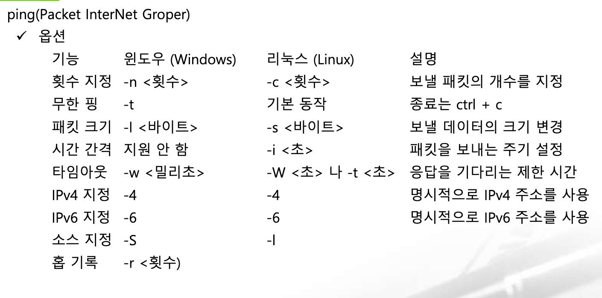
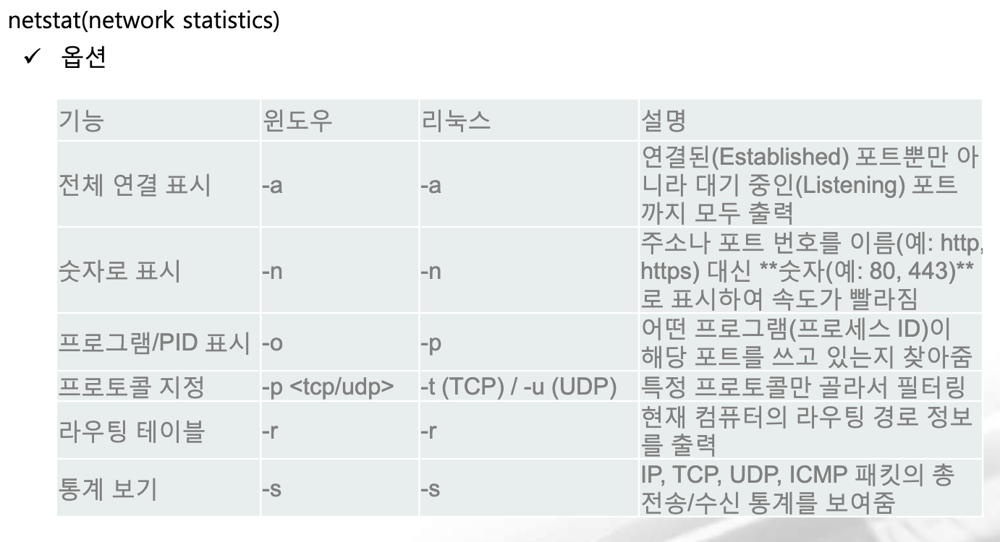

# Network

## 통신기술

### 3) DHCP

**개요**

- 수동으로 IP와 네트워크 정보를 직접 설정하는 것을 **정적 할당**이라고 하고 자동으로 설정하는 것을 **동적 할당**
- 일반적으로 데이터 센터의 서버 팜과 같은 운영망에서는 정적 할당을 하고 PC 사용자들은 동적 할당을 사용
- 보안이나 관리 목적으로 사무실의 사용자 PC를 정적 할당을 이용하는 경우가 있었지만 최근에는 동적 할당 방식을 이용하면서도 보안을 강화하고 쉽게 관리해줄 수 있도록 도와주는 서비스와 장비가 대중화돼서 동적 할당 방식이 더 많이 사용된다.
    - Public Cloud에서 컴퓨터를 임대하는 경우는 기본적으로 동적 할당인데 한 번 구동을 하게 되면 재부팅하기 전까지는 IP가 고정된다.
    - IP 고정하고자 하는 경우는 별도로 IP를 구매한다.
- IP를 동적으로 할당할 때 사용되는 프로토콜이 **DHCP(Dynamic Host Configuration Protocol)**
- DHCP를 사용하면 **IP주소, 서브넷 마스크, 디폴트 게이트웨이, DNS** 정보를 자동으로 설정
- DHCP는 기본적으로 **68, 67번 포트**를 사용하며 **UDP**로 통신

**서버 구성**

- 윈도우나 리눅스 서버의 DHCP 서비스를 이용할 수 있고 스위치, 라우터, 방화벽, VPN, IP공유기 등에서도 설정이 가능하다.
- 설정 항목

| 항목 | 설명 |
| --- | --- |
| IP 주소 풀 | 클라이언트에 할당할 IP 주소 범위(192.168.200.0/22) |
| 예외 IP 주소 풀 | IP 주소 풀에서 클라이언트에 할당하지 않을 주소(192.168.200.1, 192.168.203.255) |
| 임대 시간 | 기본 임대 시간 |
| 서브넷 마스크 | 255.255.255.0 |
| 게이트웨이 | 192.168.200.1 |
| DNS | 8.8.8.8 |

### 4) 네트워크 명령어

**ping**

**ICMP** 프로토콜을 이용해서 목적지에 메시지를 전송하고 응답을 받아오는 명령어

- HOP: 라우터 개수

**tcping (윈도우즈 명령어)**

- Ping은 목적지 단말이 살아 있는지 확인하고 출발지와 목적지까지의 네트워크가 잘 연결되어 있는지 확인하는 명령인데 목적지 단말까지의 중간 경로에 문제가 발생한 경우 icmp error 메시지를 활용해 라우팅 문제가 발생한 경우 일부 파악이 가능하지만 목적지 단말이 잘 살아 있고 중간 경로에 문제가 없더라도 실제 서비스를 위해 사용되는 **서비스 포트**가 정상 상태인지 ping만으로는 확인할 수 없음

명령: `tcping [옵션] 목적지_ip주소`

옵션
- `-n 횟수`
- `-t`: 무한 전송
- `-i 시간간격`
- `serverport`: 설정하지 않으면 80

**traceroute**

- 개요
    - 출발지부터 목적지까지의 네트워크 경로를 확인할 때 사용하는 명령어
    - ping은 목적지 단말이 잘 동작하는지 확인하는데 사용하고 icmp 메시지를 이용해서 중간 경로에 문제가 있을 떄 이것을 확인할 수 있으며 traceroute 는 중간 경로의 더 상세한 정보를 얻는데 사용
    - 출발지에서 목적지까지의 **라우팅 경로**를 확인할 수 있고 문제가 발생했다면 어느 구간부터 문제가 발생했는지 찾아낼 수 있다.
    - 장비에서 수행하는 경우는 정상적인 경로를 파악하기 위해서 두 장비 모두에서 수행해서 결과를 비교해야 한다.

옵션

| 옵션 | 설명 |
| --- | --- |
| I | icmp 패킷을 전송하는데 방화벽을 통과할 확률이 높아짐 |
| T | TCP 사용하는 옵션으로 80번 포트 확인 |
| p <포트> | 포트 확인 |
| n | 역방향 DNS 조회를 하지 않는 옵션으로 결과를 빠르게 얻고자 할 때 사용(윈도우에서는 d) |
| m <숫자> | 최대 홉 지정하는 것인데 기본값은 30(윈도우에서는 h) |
| q <숫자> | 패킷 개수를 설정하는 것인데 기본은 3개이므로 1개로 조정해서 속도를 높일 수 있다. |
| w <초> | 타임아웃 시간 설정 |
| s 소스IP | 출발지 주소를 지정 |

**tcptraceroute**

- traceroute는 경로 추적만 가능하고 서비스를 위한 서비스 포트가 정상적으로 열렸는지는 확인이 불가능
- 서비스에 문제가 발생한 경우 중간 경로에서 문제가 발생한 것인지 최종 목적지에서 차단되었는지 목적지 단말에서 서비스를 제대로 오픈 했는지 확인해야 하는데 이 때 사용하는 명령이 `tcptraceroute`
    - `sudo tcptraceroute -n google.com 80`

**netstat**

- 개요
    - 서버의 다양한 네트워크 상태를 확인하는 명령
    - 서비스 포트를 확인하는 용도로 많이 사용
    - 현재 서버에서 특정 서비스가 정상적으로 열려있는지 (listening) 또는 외부 서비스와 TCP 세션이 정상적으로 맺어져 있는지 (ESTABLISHED), 서비스가 정상적으로 종료되고 있는지(TIME_WAIT, FIN_WAIT, CLOSE_WAIT) 여부 등을 확인

- 자주 사용하는 형식
    - 윈도우: `netstat -ano`
    - 리눅스: `sudo netstat -ntlp`
        - `sudo netstat -ntlp | grep 8080`
        - `sudo kill -9 5678`
- 네트워크 연결 상태

| 상태 | 설명 |
| --- | --- |
| `LISTEN` | 서버 애플리케이션이 클라이언트의 접속을 받기 위해서 포트를 열어놓고 기다리는 상태 |
| `ESTABLISHED` | 서로 연결이 완벽하게 수립되어 데이터를 정상적으로 주고 받는 상태 |
| `TIME_WAIT` | 데이터 송수신이 끝나고 종료하는 과정 중 하나로 유실된 패킷이 늦게 도착할 수 있어서 잠시 기다리는 상태 |

**nslookup**

- **DNS**에 질의를 해서 다양한 도메인 관련 내용을 전송 받을 수 있는 명령어

**ipconfig (윈도우 명령어) / ifconfig (리눅스 - 패키지를 설치해야함)**

- 현재 활성화된 모든 네트워크 인터페이스를 확인하는 명령인데 비활성화된 것까지 확인할 때는 윈도우는 `/all` 이고 리눅스는 `-a`
- 인터넷 연결 상태 안 좋을 때 수행

| 명령 | 설명 |
| --- | --- |
| `ipconfig /release` | 현재 공유기로부터 할당받은 IP 주소 반납 |
| `ipconfig /renew` | 현재 공유기로부터 IP 다시 할당 |
| `ipconfig /flushdns` | dns 캐시 삭제 |

**tcpdump**

- 개요
    - 네트워크 인터페이스로 오가는 **패킷을 캡쳐**해주는 명령어
    - 장애 처리나 패킷 분석이 필요할 때 사용
    - 리눅스 서버에서 가능하고 리눅스 커널 기반의 장비에서도 사용 가능

옵션

| 옵션 | 설명 |
| --- | --- |
| `-i 인터페이스` | 캡처할 네트워크 카드 지정 (예: eth0, any는 모든 인터페이스) |
| `-n` | 주소 변환을 하지 않음(IP 주소와 포트 번호를 도메인/서비스명 대신 숫자로 그대로 표시 -> 속도가 빨라짐 예: Localhost -> 127.0.0.1) |
| `-nn` | 서비스 포트를 실제 포트 번호로 표기(예: http -> 80) |
| `-X` | 패킷의 내용을 헥사(Hex)와 ASCII 문자 형태로 화면에 출력 (데이터 확인용) |
| `-c 개수` | 지정한 개수의 패킷만 캡처하고 종료 |
| `-w 파일명` | 캡처한 패킷을 화면에 뿌리지 않고 .pcap 파일로 저장 (Wireshark에서 분석 가능) |
| `-r 파일명` | 저장된 .pcap 파일을 읽어서 화면에 출력 |
| `src IP주소` | 출발지 IP 주소를 지정해 필터링 |
| `dst IP주소` | 목적지 IP 주소를 지정해 필터링 |
| `host IP주소` | 출발지/목적지 상관없이 IP 주소를 지정해 필터링 |
| `src port 포트번호` | 출발지 포트 번호를 지정해 필터링 |
| `dst port 포트번호` | 목적지 포트 번호를 지정해 필터링 |
| `port 포트번호` | 출발지/목적지 상관없이 tcp 포트를 지정해 필터링 |
| `tcp 또는 udp` | tcp 또는 udp 만 필터링 |

예시: `sudo tcpdump -i enp0s1 tcp port 80`

## 네트워크 장비

### 1) Switch

**장비 동작**

- 개요
    - 스위치는 네트워크 중간에서 패킷을 받아 필요한 곳에만 보내주는 **네트워크의 중재자** 역할을 수행
    - 스위치는 아무 설정없이 네트워크에 연결해도 **MAC 주소**를 기반으로 패킷을 전달하는 기본 동작을 수행할 수 있음
    - 스위치는 MAC 주소를 인식하고 패킷을 전달하는 기본 동작 이외에 한 대의 장비를 가지고 논리적으로 네트워크를 분리할 수 있는 **VLAN** 기능과 네트워크 루프를 방지하는 `STP(Spanning Tree Protocol)` 와 같은 기능을 소유하고 있고 최신 장비들에서는 보안 기능과 모니터링에 필요한 여러 기능을 가지고 있다.

- `Packet & Frame`
    - 헤더와 데이터를 합친 것을 `PDU(Protocol Data Unit)` 라고 한다.
    - 계층마다 PDU를 부른 이름이 다름

    | 계층 | PDU 이름 |
    | --- | --- |
    | 1계층 | 비트의 모임 |
    | 2계층 | Frame |
    | 3계층 | Packet(일정한 크기) |
    | 4계층 | Segment(일정하지 않은 크기) |
    | 나머지 계층 | Data |

- 역할
    - 네트워크에서 통신을 중재하는 장비
    - 스위치가 없던 시절(Hub 를 사용하는 경우) 패킷을 전송할 때 경합해서 네트워크 성능 저하가 컸음
    - 스위치를 사용하면 여러 단말이 한꺼번에 통신할 수 있어서 네트워크 전체의 통신 효율성이 높아짐
    - 스위치의 핵심 역할은 어떤 장비가 어느 위치에 있는지 파악하고 실제 통신이 시작되면 자신이 알고있는 위치로 패킷을 정확히 전송하는 것인데 이를 위해서 MAC 주소와 인터페이스 정보를 매핑한 **MAC 테이블**을 소유하고 있음
    - 스위치의 동작
        - `Flooding`
            - 스위치는 부팅을 하면 네트워크 관련 정보가 아무것도 없음
            - 부팅을 했을 때는 허브와 동일한 동작
            - 데이터 전송 요청이 오면 연결된 모든 인터페이스에 데이터를 전달
            - 데이터 전송 요청한 곳의 MAC 주소를 기억
            - 플러딩은 스위치의 성능을 저하시킨다.
            - 스위치의 기본 기능을 무력화시켜서 공격을 하는 기법이 존재하는데 인터페이스에 연결되지 않은 MAC 주소를 학습시키거나 스위치의 MAC Address Table 을 꽉 차게해서 스위치의 플러딩 동작을 유도할 수 있음
        - `Address Learning`
            - `MAC Address Table`을 만들고 유지하는 과정이 `Address Learning`
            - 패킷의 출발지 MAC Address 를 가지고 학습
            - 사전에 학습된 MAC Address Table: 스위치 간 통신을 위해서 사용하는 주소
        - `Forwarding/Filtering`
            - 이미 학습된 MAC Address 로 데이터를 전송하는 경우 연결된 인터페이스로 데이터를 포워딩하고

- 사용
    - VLAN 설정 작업이 메인
- LAN에서의 ARP
    - 이더넷-TCP/IP 네트워크에서는 스위치가 유니캐스트를 플러딩 하는 경우는 거의 없음
    - 패킷을 만들기 전에 통신을 수행해야 할 단말의 MAC 주소를 알아내기 위해서 **ARP 브로드캐스트**가 먼저 수행되어야 하므로 유니캐스트보다 ARP 브로드캐스트가 먼저 네트워크에 전달되기 때문에 실제 유니캐스트 전송이 시작되면 이미 만들어진 MAC Address로 패킷을 포워딩 및 필터링
    - ARP와 MAC Address 테이블은 일정 시간 동안 지워지지 않는데 이 시간을 **Aging Time** 이라고 하는데 일반적으로 MAC Address Table의 에이징 타임의 단말의 ARP 에이징 타임보다 길어서 이더넷 네트워크에서 플러딩 없이 효율적으로 운영할 수 없음

**VLAN**

- **개요**
    - 물리적 배치와 상관없이 LAN을 논리적으로 분할 구성하는 기술
    - 기업처럼 여러 부서가 함께 근무하면서 각 부서 별로 네트워크를 분할 할 때는 네트워크를 여러 개 운영해야함
    - 부서 별로 분할하지 않으면 과도한 브로드캐스트로 단말의 성능이 저하되고 보안도 취약해지므로 서비스 성격에 따라 네트워크를 분할해야
    - VLAN을 이용하면 하나의 장비를 가지고 여러 개의 네트워크를 구성할 수 있다.
    - VLAN 간의 통신은 서로 다른 네트워크 간의 통신이 되므로 **3계층 장비**가 필요
    - VLAN을 이용하면 다른 장비에 연결된 단말들도 하나의 네트워크로 묶을 수 있다.
- **종류와 특징**
    - **포트 기반의 VLAN**
        - 일반적인 VLAN으로 스위치의 특정 포트에 VLAN을 할당해서 포트에 연결된 장비는 무조건 특정 VLAN에 소속이 되는 형태
    - **MAC 주소 기반의 VLAN**
        - 포트에 VLAN을 할당하는 것이 아니고 단말의 MAC 주소를 기반으로 VLAN을 할당하는 기술
        - 단말이 연결되면 단말의 MAC 주소를 인식한 스위치가 해당 포트를 지정된 VLAN으로 변경을 하는 방식
        - 포트의 VLAN이 변경될 수 있기 때문에 **Dynamic VLAN**이라고도 함
    - 데이터 센터의 VLAN은 일반적으로 포트 기반의 VLAN
    - 이동이 많은 스마트 오피스의 경우는 MAC 기반의 VLAN을 사용
- **VLAN Mode 동작 방식**
    - 포트 기반의 VLAN에서는 스위치의 각 포트에 각각 사용할 VLAN을 설정하는데 한 대의 스위치에 연결되더라도 서로 다른 VLAN이 설정된 포트간에는 내부 통신을 할 수 없음
    - 별도의 분리된 스위치에 연결된 것과 같으므로 VLAN 간 통신이 불가능
    - 서로 다른 VLAN 간 통신을 위해서는 3계층 장비를 사용해야 함.
    - 여러 개의 VLAN이 존재하는 상황에서 스위치를 서로 연결해야 하는 경우에 각 VLAN끼리 통신하고자 하면 VLAN 개수만큼 포트를 연결해야 함
    - VLAN으로 분할된 스위치는 물리적인 별도의 스위치처럼 취급
    - VLAN을 많이 사용하는 대형 네트워크에서는 VLAN 별로 포트를 연결하면 장비 간의 연결만으로 많은 포트가 낭비
    - **태그 기능**은 하나의 포트에 여러 개의 VLAN을 함께 전송할 수 있게 해줌
    - 이러한 태그 기능을 가진 포트를 **Tagged Port** 또는 **Trunk Port** 라고 함
    - 태그 포트는 통신을 할 때 이더넷 프레임 중간에 VLAN ID 필드를 추가해서 데이터를 전송
    - 패킷을 보낼 때는 VLAN ID를 붙여서 전송하고 수신 측에서는 VLAN ID를 제거하면서 사용
    - Trunk
        - 스위치 간 VLAN 정보를 보낼 수 있는 포트의 일반적인 이름은 태그 포트
        - 트렁크라는 용어는 시스코에서 사용하는 명칭
        - 다른 장비에서는 여러 개의 포트를 묶어 사용하기 위한 **링크 애그리게이션**의 의미
- **VLAN이 있는 상태에서의 스위치의 MAC Address Table**
    - 다른 VLAN끼리 통신하지 못하도록 MAC 테이블에 VLAN을 지정하는 필드가 추가
    - 하나의 스위치에 여러 개의 MAC 테이블이 존재하는 것처럼 동작
    - 일반적인 포트를 **Untagged 포트** 또는 **Access 포트**라고 하고 VLAN 정보를 넘겨 여러 VLAN이 한꺼번에 통신하도록 해주는 포트를 **태그포트** 또는 **트렁크 포트**라고 부름
    - 태그 포트는 여러 네트워크가 동시에 설정된 스위치 간의 연결에서 사용되며 하나의 네트워크에 속한 서버의 경우는 언테그로 설정
    - 스위치 간의 연결이 아닌 서버와 연결된 포트도 VMware의 ESXi 와 가상화 서버가 연결될 때는 여러 VLAN 과 통신해야 할 수도 있는데 이 경우 서버와 연결된 스위치의 포트더라도 언태드 포트가 아닌 태그로 설정
    - 가상화 서버쪽 인터페이스에서도 태그된 포트로 설정해야함
    - 가상화 서버 내부에 가상 스위치가 존재하므로 스위치 간 연결로 보면 이해하기 더 쉬움
    - 하나의 시스템이나 구성 요소에서 곶ㅇ이 발생했을 때 전체 시스템의 동작이 멈추는 요소
    - 네트워크에서도 하나의 장비 고장으로 전체 네트워크가 마비되는 것을 막기 위해서 **이중화** 및 **다중화**된 네트쿼으를 디자인하고 구성
    - 네트워크를 스위치 하나로 구성했을 때 그 스위치에 장애가 발생하면 전체 네트워크에 장애 발생
- **Loop**
    - **SPoF** 를 피하기 위해 스위치 두 대 이상으로 네트워크를 디자인하는데 이 경우 패킷이 네트워크를 따라 계속 전송돼서 네트워크를 마비시킬 수 있음
    - **Broadcast Storm**
        - 루프 구조로 네트워크가 연결된 상태에서 단말에서 브로드캐스트가 발생하면 스위치는 이 패킷을 패킷이 유입된 포트를 제외한 모든 포트로 플러딩
        - 플러딩된 패킷은 다른 스위치로 보내지게 되고 이 패킷을 받은 스위치는 패킷이 유입된 포트를 제외한 모든 포트로 다시 플러딩
        - 루프 구조 상태에서는 이 패킷이 계속 돌아가게 되는데 이것이 브로드캐스트 스톰
        - 3계층의 경우는 **TTL(Time to Live)** 이라는 패킷 수명을 갖고 있지만 스위치가 확인하는 2계층 헤더에는 이런 3계층의 TTL 과 같은 라이프 타임 매커니즘이 없어서 루프가 발생하면 패킷이 죽지 않고 계속 살아남아 패킷 하나가 전체 네트워크 대역폭을 차지할 수 있음
        - 스위치와 네트워크에 연결된 단말간 통신이 거의 불가능한 상태가 될 수 있음
        - 결과
            - 네트워크에 접속된 단말의 속도가 느려짐
            - 네트워크에 설치된 스위치의 모든 LED 들이 동시에 빠른 속도로 깜빡
    - **MAC Address Flapping**
        - MAC Address 를 중복으로 학습하는 문제
        - 중간에 있는 스위치에서 데이터가 들어오는 곳의 포트를 확인해서 MAC Address를 저장할 때 양쪽에서 들어오게 돼서 동일한 MAC Address 를 다른 곳에 있다고 판단
        - 설정에서 이런 상황이 발생하면 경고 메시지를 보내도록 하던가 보통 때는 하나의 포트를 셧다운 시키는 방식으로 해결
- **Spanning Tree Protocol**
    - 루프를 확인하고 적절히 포트를 사용하지 못하게 만들어 루프를 예방하는 매커니즘
    - 루프가 생기지 않도록 유지하는 것이 스패닝 트리 프로토콜의 목적
    - 루프를 예방하려면 전체 스위치가 어떻게 연결되는지 알아야하는데 전체적인 스위치 연결 상황을 파악하려면 스위치 간에 정보를 전달하는 방법이 필요한데 이를 위해 스위치는 **BPDU(Bridge Protocol Data Unit)** 라는 프로토콜을 통해 스위치 간에 정보를 전달하고 이렇게 수집된 정보를 이용해서 전체 네트워크 루프 구간을 확인
    - BPDU에는 스위치가 갖고 있는 ID와 같은 고유값이 들어가고 이런 정보들이 스위치 간에 서로 교환되면서 루프 파악이 가능한데 이렇게 확인된 루프 지점을 데이터 트래픽이 통과하지 못하도록 차단해서 루프를 예방
- **스위치 포트의 상태 및 변경 과정**
    - 스패닝 트리 프로토콜이 동작 중인 스위치에서는 루프를 막기 위해 스위치 포트에 신규 스위치가 연결되면 바로 트래픽이 흐르지 않도록 차단하고 해당 포트로 트래픽이 흘러도 되는지 확인하기 위해서 BPDU를 기다려 학습하고 구조를 파악한 후 트래픽을 흘리거나 루프 구조인 차단 상태를 유지
    - 차단 상태에서 트래픽이 흐를 때까지 스위치 포트의 상태
        1. **Blocking**
        2. **Listening**
        3. **Learning**
        4. **Forwarding**
    - 이 과정을 거치는데 **50초** 정도 시간이 소요
    - STP가 활성화된 경우 스위치 포트는 곧바로 포워딩 상태가 되지 않기 때문에 장애가 발생하거나 스위치 이상으로 생각하는 경우가 많음
    - 부팅 시간이 매우 빠른 OS가 DHCP 네트워크에 접속할 때 부팅 단계에서 IP를 요청하지만 스위치 포트가 포워딩 상태가 되지 않아 IP를 정상적으로 할당받지 못하는 경우가 많음
- **STP 동작 방식**
    - 하나의 **루트 스위치**를 선정
    - 루트가 아닌 스위치 중 하나의 **루트 포트**를 선정
        - 루트 스위치에서 보낸 BPDU를 받는 포트
    - 스위치와 스위치가 연결되는 포트를 하나의 **지정 포트**로 선정을 하고 루프 포트이고 하나는 지정 포트인 경우 포워딩 상태로 만들고 모두 지정 포트인 경우는 한 쪽은 지정 포트로 하고 다른 쪽은 **대체 포트**로 선정
- **스패닝 트리 프로토콜 사용 시 고려할 사항**
    - 스패닝 트리 프로토콜은 스위치끼리 연결될 때 문제인데 PC나 기타 장비가 연결되는 경우는 스패닝 트리 프로토콜과는 아무런 상관이 없음
    - 스위치가 연결되지 않는 포트들은 **Port Fast**로 설정해서 BPDU 대기나 습득가정없이 바로 사용 가능
- **RSTP**
    - 스패닝 트리 프로토콜은 이중화된 스위치 경로 중 정상적인 경로에 문제가 발생하면 백업 경로를 활성화하는데 30~50초가 걸림
    - 이런 문제를 해결하기 위해서 등장한 프로토콜이 Rapid
    - 기본적인 구성이나 방법은 STP 와 동일한데 넘겨주는 BPDU 구성을 다르게 해서 **2~3초** 정도의 전환시간을 갖게 함.
- **MST**
    - 일반 스패닝 트리 프로토콜은 VLAN 개수에 상관없이 스패닝 트리 한 개만 동작하는데 이 경우 VLAN이 많더라도 스패닝 트리는 한 개만 동작하면 되므로 스위치의 관리 부하가 적지만 루프가 생기는 토폴리지에서 한 개의 포트와 회선만 활성화 되므로 자원을 효율적으로 활용할 수 없음
    - 이 문제를 해결하기 위해서 **PVST**가 개발되었고 VLAN 마다 다른 스패닝 트리 프로세스가 동작하므로 VLAN 마다 별도의 경로와 트리를 만들 수 있게 되는데 최적의 경로를 디자인하고 VLAN 마다 별도의 블록 포트를 지정해서 별도의 스패닝 트리를 유지해야 해서 부담이 큼
    - PVST의 단점을 보완하기 위해서 **MST**가 개발됨
    - 여러 개의 VLAN을 하나의 그룹으로 만들어서 그룹 별로 스패닝 트리가 동작하도록 하는 방식
- **스패닝 트리 프로토콜의 대안**
    - 루프 예방에는 필수적인 프로토콜이지만 스위치에 부담이 많은 프로토콜이고 포트가 차단되거나 늦게 포워딩돼서 불편함이 많음
    - 장비 제조업체는 여러 종류의 대안을 제시

    | 대안 | 설명 |
    | --- | --- |
    | SLPP | Nortel 사가 개발한 루프 예방 프로토콜 |
    | Extreme STP | Extreme 사가 개발한 루프 예방 프로토콜 |
    | Loop Guard | STP 와 다른 매커니즘으로 루프를 확인 |
    | BPDU Guard | BPDU 가 인입될 경우 해당 포트를 차단 |

- **스위치에 IP를 할당하는 경우**
    - 스위치는 2계층에서 동작하는 장비여서 MAC 주소만 이해할 수 있기 때문에 스위치가 동작하는데 IP는 필요없지만 일정 규모 이상의 네트워크에서 운영되는 스위치는 관리 목적으로 IP 주소를 할당
    - 스위치 원격 관리용 텔넷이나 SSH 그리고 웹과 같은 서비스를 이용하기 위해서 할당

### 2) Router/L3 Switch

- **개요**
    - 3계층에서 동작하는 여러 네트워크 장비의 대표격으로 경로를 지정해주는 장비
    - 라우터에 들어오는 패킷의 목적지 IP 주소를 확인하고 자신이 가진 경로 정보를 이용해서 패킷을 최적의 경로로 포워딩해주는 장비
    - 원격지 네트워크와 연결할 때 필수 네트워크 장비이며 네트워크를 구성하는 핵심 장비

- **L3 스위치**
    - 라우터처럼 3계층에서 동작하는 스위치
    - 라우터의 기능은 소프트웨어로 구현하고 스위치는 하드웨어로 구현하는 형태로 만듦
    - 지금은 라우터와 L3 스위치를 구분하기 어려움

- **라우터의 동작 방식과 역할**
    - 라우터는 다양한 경로 정보를 수집해서 최적의 경로를 라우팅 테이블에 저장한 후 패킷이 라우터로 들어오면 도착지 IP 주소와 라우팅 테이블을 비교해서 최적의 경로로 패킷을 내보냄
    - 스위치와 반대로 라우터는 패킷의 목적지 주소가 라우팅 테이블에 없으면 패킷을 버림
    - 라우터는 패킷 포워딩 과정에서 기존 2계층 헤더 정보를 제거한 후 새로운 2계층 헤더를 만들어 냄
    - 라우터의 동작 방식을 경로 지정, 브로드캐스트 컨트롤, 프로토콜 변환이라고 함
    - 경로 지정
        - 라우터는 경로를 지정해 패킷을 포워딩하는 역할을 두 가지 구분해서 수행하는데 경로 정보를 얻는 역할과 얻은 경로 정보를 확인하고 패킷을 포워딩하는 부분으로 구분
        - 라우터는 자신이 얻은 경로 정보에 포함되는 패킷만 포워딩하므로 정확한 목적지 경로를 얻는 것이 매우 중요
    - 프로토콜 변환
        - 지금의 네트워크에서는 대부분 이더넷을 사용하기 때문에 프로토콜 변환은 많이 축소되었지만 LAN은 내부 네트워크에서 다수의 컴퓨터가 함께 통신하는데 초점을 맞추었고 WAN은 원거리 통신이 목적이므로 LAN 기술이 WAN 기술로 변환되어야만 원격지 네트워크와 통신이 가능
        - 예전에는 WAN 구간에서는 PPP 라는 프로토콜을 LAN 구간에서는 이더넷 프로토콜을 사용했기 때문에 라우터를 지나면서 2계층까지의 헤더가 벗겨지고 WAN 구간으로 패킷이 나올 때 PPP 헤더로 변경됨.

- **경로 지정**
    - 라우터는 자신이 분명히 알고 있는 주소가 아닌 목적지를 가진 패킷이 들어오면 해당 패킷을 버리므로 패킷이 들어오기 전에 경로 정보를 충분히 수집하고 있어야 라우터가 정상적으로 동작
    - 인터넷에 존재하는 주소와 경로는 매우 많고 점점 늘어나고 있는데 클래스리스 네트워크로 전환된 후에는 같은 클래스 있는 주소조차 서브네팅된 상태로 분산되어 존재하므로 경로 정보가 기존보다 훨씬 많아짐
    - 라우터는 이런 복잡하고 많은 경로 정보를 얻어 최적의 경로 정보를 라우팅 테이블에 적절히 유지해야 하는데 라우터는 많은 정보를 가지고 있지만 원하는 목적지 정보와 정확히 일치하지 않는 경우가 더 많음
    - 라우터는 서브넷 단위로 라우팅 정보를 습득하고 라우팅 정보를 최적화하기 위해 서머리 작업을 통해 여러 개의 서브넷 정보를 뭉쳐서 전달
    - 라우터에 들어온 패킷의 목적지 주소와 라우터가 갖고 있는 라우팅 테이블 정보가 정확히 일치하지 않더라도 수 많은 정보 중 목적지에 가장 근접한 정보를 찾아 패킷을 포워딩 해야 함.
    - 현재 인터넷에서는 단말부터 목적지까지의 경로를 모두 책임지는 것이 아니라 인접한 라우터까지만 경로를 지정하면 인접 라우터에서의 최적의 경로를 다시 파악해서 라우터로 패킷을 포워딩
    - 네트워크를 한 단계씩 뛰어넘는다는 의미로 이 기법을 Hop-by-Hop 라우팅이라고 부르고 인접한 라우터를 Next Hop 이라고 함
    - 라우터는 패킷이 목적지로 가는 전체 경로를 파악하지 않고 최적의 넥스트 홉을 선택해서 보내줌
    - 넥스트 홉을 지정하는 방법
        - 다음 라우터의 IP를 지정하는 방법
        - 라우터의 나가는 인터페이스를 지정하는 방법
        - 라우터의 나가는 인터페이스와 다음 라우터의 IP를 동시에 지정하는 방법
    - 대부분의 경우에는 다음 라우터의 IP를 지정하는 방법을 이용하는데 상대방 넥스트 홉 라우터의 인터페이스 IP 주소를 지정하는 방법을 사용
    - 라우터는 루프가 없음
        - 3계층의 IP 헤더에는 TTL(Time To Live) 이라는 필드가 존재해서 패킷이 네트워크에 살아 있을 수 있는 시간(Hop)을 제한
        - 패킷이 영구적으로 사라지지 않는다 장비간에 동일한 패킷이 Ping Pong 을 치거나 사라지지 않는 유령 패킷이 될 수 있음
        - 패킷이 라우터를 지나갈 때마다 TTL 값을 1씩 감소시켜서 이 값이 0이 되면 네트워크 장비에서 버려짐

- **라우터가 경로 정보를 얻는 방법**
    - `다이렉트 커넥티스`
        - 직접 케이블로 연결된 경우에 인터페이스에 IP를 설정하면 자동 생성되는 정보
        - 강제로 삭제할 수 없고 해당 네트워크 설정을 삭제하거나 해당 네트워크 인터페이스가 비활성화되어야만 자동으로 사라짐
    - `Static Routing`
        - 관리자가 목적지 네트워크와 넥스트 홉을 라우터에 직접 지정해서 경로 정보를 입력하는 것
        - 관리자가 직접 지정하므로 라우팅 정보를 매우 직관적으로 설정 및 관리
        - 다이렉트 커넥티드처럼 연결된 인터페이스 정보가 삭제되거나 비활성화되면 연관된 스태틱 라우팅 정보가 같이 삭제됨
    - `Dynamic Routing`
        - 정적 라우팅은 변화가 작은 네트워크에서는 손쉽게 사용할 수 있지만 큰 네트워크에서는 스태틱 라우팅 만으로는 관리가 어려움
        - 스태틱 라우팅은 라우터 너머의 다른 라우터의 상태 정보를 파악할 수 없어 라우터 사이의 회선이나 라우터에 장애가 발생하면 장애 상황을 파악하고 대체 경로로 패킷을 보낼 수 없기 때문
        - 라우터끼리 자신이 알고 있는 경로 정보나 링크 상태 정보를 교환해서 전체 네트워크 정보를 학습
        - 주기적으로 또는 상태 정보가 변경될 떄 라우터끼리 경로 정보가 교환되므로 라우터를 연결하는 회선이나 라우터 자체에 장애가 발생하면 이 상황을 인지해 대체 경로로 패킷을 포워딩 할 수 있음