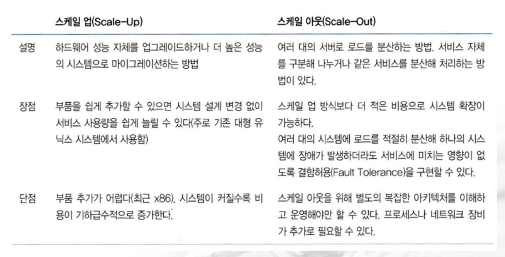
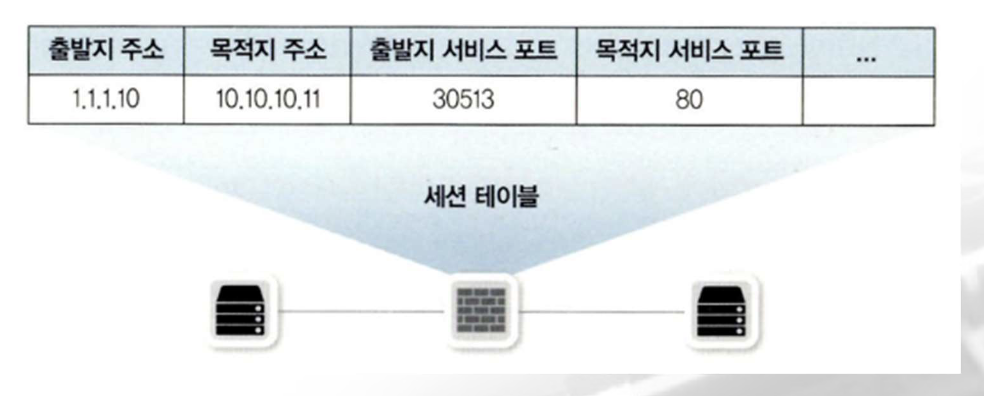

# 네트워크

## 네트워크 장비

### 2) Router/L3 Switch

- **라우터가 경로 정보를 지정하는 방법**
    - 패킷이 들어와 라우팅 테이블을 참조하고 최적의 경로를 찾아 라우터 외부로 포워딩 작업을 스위칭이라고 한다.
    - 패킷을 최선의 경로로 내보낼 때도 여러가지를 고려해봐야 하는데 들어온 패킷의 목적지가 라우팅 테이블에 있는 정보와 완벽히 일치할 때도 있지만 비슷하게 일치하거나 일치하지 않는 경우도 발생
    - `longest prefix match` 기법을 이용해서 알고 있는 경로 정보 중 가장 가까운 경로를 선택
    - 라우팅 테이블
        ```
        10.1.1.0/24 Ethernet 2
        10.1.1.5/32 Ethernet 1
        10.1.0.0/16 Ethernet 3
        10.1.2.0/24 Ethernet 2
        10.0.0.0/8 Ethernet 1
        10.1.2.9/32 Ethernet 3
        ```

        - 라우터에 10.1.1.9로 전송을 하는 패킷이 인입
        - 10.1.1.9 와 정확히 일치하는 정보는 존재하지 않음
        - 10.1.1.9 를 포함하는 라우팅 정보를 찾음

        ```
        10.1.1.0/24
        10.1.0.0/16
        10.0.0.0/8
        ```
        - 3개의 라우팅 정보를 10.1.1.9를 포함하고 있는데 여기서 가장 많이 일치하는 네트워크 대역을 선택
        - 이 작업을 매번 수행하는 것은 자원의 낭비
        - 한 번 스위칭한 정보는 캐시에 저장해두고 뒤에 들어오는 패킷은 라우팅 테이블보다 먼저 캐시를 확인한 후 라우팅 테이블을 확인
        - 인터넷에서는 패킷 단위로 데이터를 분할해서 전송하기 때문에 하나의 패킷이 전송되면 그 다음에 동일한 목적지를 향한 패킷이 연달아 올 가능성이 높기 때문에 캐시를 이용하면 빠르게 전송이 가능
        - 최근에는 넥스트 홉 L2 정보까지 캐시해서 스위칭 시간을 줄여준다.
        - 캐시로 사용하는 데이터베이스가 Redis

- **라우팅/스위칭 우선 순위**

    - 라우팅 테이블은 가장 좋은 경로 정보만 모아놓은 핵심 정보
    - 일반적인 경로 정보를 모아놓은 토폴로지 테이블에서 좋은 경로 정보의 우선순위는 경로 정보를 얻은 방법과 거리를 기준으로 정함
    - 목적지 네트워크 정보가 동일한 서브넷을 사용하는 경우 정보를 얻은 소스에 따라 가중치를 정함
    - 가중치 값은 라우팅 정보의 분류와 동일하게 3가지
        - 다이렉트 커넥티드
        - 정적 라우팅
        - 동적 라우팅
    - 우선 순위가 가장 높은 것을 라우터에 바로 연결되는 다이렉트 커넥티드
    - 다이렉트커넥티드 > 정적 라우팅 > 동적 라우팅
    - 기본적인 우선 순위는 미리 정해져있지만 필요에 따라 관리자가 우선 순위를 조정해서 라우팅 경로를 조정 가능

### 3) 4계층 장비

- **개요**
    - 기존 네트워크 장비는 스위치와 라우터처럼 2계층과 3계층에서 동작하는 장비를 지칭하는 용어였지만 IP 부족으로 NAT 기술이 등장하고 보안용 방화벽, 프록시와 같은 장비들이 등장하면서 4계층 이상에서 동작하는 장비가 많아지면서 4계층에서 동작하는 장비도 네트워크 장비에 포함
    - 4계층의 특징인 포트 번호, 시퀀스 번호, ACK 번호를 붙여서 사용
    - 통신의 방향성이나 순서와 같은 통신 전반에 대한 관리가 필요하고 이런 정보를 Session Table 이라는 공간에 담아 관리

- **특징**

    - 4계층 헤더에 있는 정보를 이해하고 이 정보들을 기반으로 동작
    - 4계층 이상에서 동작하는 Load Balancer, Firewall 과 같은 장비를 세션 장비라고 부르기도 함
    - 세션 장비가 고려해야 할 특징
        - 세션 테이블
            - 세션 장비는 세션 테이블을 기반으로 운영
            - 세션 정보를 저장 및 확인하는 작업 전반에 대한 이해가 필요
            - 세션 정보는 세션 테이블에 남아있는 라이프 타임이 존재하므로 이 부분에 대한 고려가 필요
        - Symmetric (대칭) 경로 요구: Inbound 와 Outbound 경로가 일치해야함
        - 정보 변경: IP 주소가 변경되며 확장된 L7 Load Balancer 는 애플리케이션의 프로토콜 정보도 변경

    - 네트워크 통신 중간에 세션을 기반으로 동작하는 방화벽, NAT, Load Balancer 와 같은 장비가 있을 경우 네트워크 인프라 뿐만 아니라 시스템 설계와 애플리케이션 개발에도 세션 장비에 대한 고려가 필요

- **Load Balancer**
    - 개요
        - 서버나 장비의 부하를 분산하기 위해 사용하는 장비
        - 4계층 이상에서 동작하면서 IP 주소나 4계층 정보 또는 애플리케이션 정보를 확인 및 수정하는 기능도 있지만 가장 많이 사용하는 분야는 서버의 부하 분산
        - 사용자 천명의 요청을 동시에 처리해주는 서버보다 5천명의 요청을 동시에 처리해주는 서버의 비용이 5배 이상 비용이 소모됨
        - 작은 장비 여러 대를 묶어 사용하는 방법이 효율적인데 이런 확장 방법을 `스케일 아웃`이라고 한다.
        - 작은 시스템 여러 대를 운영하더라도 사용자는 서버 배치와 상관없이 하나의 서비스로 보여야 하는데 Load Balancer 가 서비스에 사용되는 대표 IP를 갖고 그 밑에 시스템이 늘어나면 Load Balancer가 실제 IP로 변경해 요청을 전송
        - Load Balancer는 웹 애플리케이션 뿐만 아니라 FWLB(FireWall Load Balancer), VPNLB(Virtual Private Network Load Balancer) 와 같이 다양한 서비스와 조합돼서 사용될 수 있음
    - 분류
        - `L4 Load Balancer`
            - 일반적인 Load Balancer
            - TCP, UDP(포트 번호)를 기반으로 Load Balancer을 수행
            - 최근의 Load Balancer 는 L4 와 L7의 기능을 모두 지원하므로 4계층에 대한 정보만으로 분산 처리하는 경우는 L4 Load Balancing 이라고 한다.
        - `L7 Load Balancer`
            - HTTP, FTP, SMTP 와 같은 애플리케이션 프로토콜 정보를 기반으로 Load Balancing을 수행
            - HTTP 헤더 정보나 URI 와 같은 정보를 기반으로 프로토콜을 이해한 후 부하를 분산할 수 있음
            - ADC(Application Delevery Controller) 라고 부르며 프록시 역할을 수행
            - Squid 나 Nginx 에서 수행하는 리버스 프록시와 유사한 기능
        - 데이터 센터나 클라우드에서 제공하는 Load Balancer는 두 가지 기능을 모두 지원하고 설정에 따라 분류
        - AWS의 경우는 Network Load Balancer, L4 Load Balancing ALB, Load Balancing 용 컴포넌트를 제공

    - `L4 Switch`
        - 4계층에서 동작하면서 Load Balancer 기능이 있는 스위치
        - 내부 동작 방식은 4계층 Load Balancer이지만 외형은 스위치처럼 여러 개의 포트를 가지고 동작
        - 서버형 로드밸런서나 소프트웨어 형태의 로드밸런서도 있지만 다양한 네트워크 구성이 가능한 스위치형 로드밸런서가 가장 대중화되어 있음
        - L4 스위치는 부하 분산 및 성능 최적화 그리고 리다이렉션 기능을 제공
        - 부하 분산
            - Virtual Server, Virtual IP, Real Server, Real IP를 설정해야함
            - 가상은 사용자가 바라보는 것이고 Real은 실제 서비스가 이루어지는 것
            - Virtual IP를 Real IP로 변경해주는 역할 - 이 과정에서 부하를 어떤 방식으로 분산할 지 결정할 수 있음
            - 포트 변경도 가능 - 실제 서비스 포트는 8080으로 하고 가상 IP에서 포트를 80으로 접근하도록 설정
    - `Health Check`
        - 로드밸런서는 부하 분산을 하는 각 서버의 서비스를 주기적으로 헬스 체크를 해서 정상적인 서비스 쪽으로만 부하를 분산하고 비정상적인 서버는 서비스 그룹에서 제외해 트래픽을 보내지 않음
        - 서비스 그룹에서 제외가 되더라도 헬스 체크를 계속 수행해서 다시 정상으로 돌아오면 서비스 그룹에 해당 장비를 다시 넣어 트래픽이 서버 쪽으로 보내지도록 함.
        - 헬스 체크 방식
            - Virtual IP에 연결된 Real Server에 ICMP(ping)를 보내서 체크하는 방법을 사용할 수 있는데 살아 있는지 여부만 체크하는 방법이므로 잘 사용하지 않음
            - Load Balancer에 설정된 서버의 서비스 포트를 확인하는 방법: 원래는 SYN/SYN, ACK/ACK까지 정상적인 3-way handshake 를 거치게 되어 있는데 헬스 체크로 인한 부하를 줄이거나 정상적인 종료 방식보다 빨리 헬스 체크 세션을 끊기 위해 TCP Half Open 방식을 사용하기도 함
            - `HTTP 상태 코드`
                - 서비스 포트까지 TCP로 정상적으로 열리지만 웹 서비스에 대한 응답을 정상적으로 해주지 못하는 경우가 있을 수 있음
                - HTTP 요청을 직접 요청해서 정상적인 상태 코드를 응답하는지 체크해서 헬스 체크를 수행할 수 있음
            - `콘텐츠 확인`
                - Load Balancer에서 서버로 콘텐츠를 요청하고 응답받은 내용을 확인하여 콘텐츠가 정상적으로 응답했는지를 확인하는 방식
        - 헬스 체크 주기와 타이머 값
            - `Interval(주기)`: Load Balancer에서 서버로 헬스 체크 패킷을 보내는 주기
            - `Response(응답 시간)`: 헬스 체크 패킷을 보내고 응답을 기다리는 시간으로 이 시간까지 응답이 오지 않으면 실패로 간주
            - `Retries(시도 횟수)`: 헬스 체크 실패 시 최대 시도 횟수로 이 횟수 이전에 성공 시 시도 횟수는 초기화
            - `Timeout`: 최대 대기 시간
            - `Dead Interval`: 서비스 다운 시의 헬스 체크 주기
    - 부하 분산 알고리즘
        - `Round Robin`
            - 특별한 규칙 없이 현재 구성된 장비에 순차적으로 돌아가면서 트래픽을 분산
            - 요청의 작업 시간이 다른 경우 작업 시간이 긴 요청에 트래픽이 늘어날 수 있음
        - `Least Connection(최소 접속 방식)`
            - 서버가 가진 세션 부하를 확인해 그것에 맞게 부하를 분산하는 방식
            - 세션 장비들은 세션 테이블을 가지고 있어서 각 장비에 연결된 현재 세션 수를 할 수 있음
            - 세션이 가장 적게 연결된 장비로 서비스 요청을 보내는 방식
            - 서비스 별로 세션 수를 관리하면서 분산해주므로 각 장비에서 처리되는 활성화 세션 수가 비슷하게 분산되면서 부하를 분산
        - 위 2가지 방식에 가중치를 주는 방식
            - 연결된 장비의 성능이 모두 동일하다면 균등하게 배분해도 되지만 연결된 장비들의 성능이 다르다면 가중치를 고려
        - `Hash`
            - 서버의 부하를 고려하지 않고 클라이언트가 같은 서버에 지속적으로 접속하도록 하기 위해 사용하는 부하 분산 방식
            - IP나 포트를 가지고 수행
            - 부하 분산 비율이 한쪽으로 치우칠 수 있는데 최근에는 거의 그런 일이 없음
    - `ADC`
        - 애플리케이션 계층에서 동작하는 Load Balancer
        - 4계층에서 동작하는 L4(MAC Address, IP Address, Port 정보 - 웹 애플리케이션까지 이해) 스위치와 달리 애플리케이션 계층에서 동작하는 Load Balancer
        - 애플리케이션 프로토콜의 헤더와 내용을 이해(웹 애플리케이션 내의 요청까지 이해)하고 동작하므로 다양한 부하 분산, 정보 수정, 정보 여과 기능이 가능
        - ADC는 이런 상세한 동작을 Proxy로 동작
        - 특별한 경우를 제외하고는 L4 기능은 가지고 있음
        - Load Balancing 이외에도 Failover(장애 극복 기능), Redirection 기능도 수행하고 Caching, Compression(압축), 콘텐츠 변환 및 재작성, 인토빙 변환 등이 가능하고 애플리케이션 프로토콜 최적화 기능도 제공
        - 플러그 인 형태로 보안 강화 기능을 제공하는 WAF(Web Application Firewall) 기능이나 HTML, XML 검증과 변환을 수행할 수 있음
        - L4 스위치에서도 Denial of Service(서비스 거부 공격) 공격을 방어하거나 서버 부하를 줄이기 위해 TCP 세션 재사용과 같은 보안과 성능을 높여주는 기능도 함께 제공할 수 있음
        - L4 스위치에서는 성능 향상을 위해서 Connection Pool(미리 연결을 해놓은 풀을 만들고 그 풀에서 사용중이지 않은 것을 빌려서 사용하는 방식)을 이용함
        - 최근에는 SSL 프로토콜을 사용하는 비중이 늘면서 웹 서버에 SSL 암호화 및 복호화 부하가 늘고 있음
        - 개인 정보 보호를 위해 개인정보가 전달되는 일부 페이지에서만 SSL을 사용해 왔지만 보안 강화를 위해 웹사이트 전체를 SSL로 처리하는 추세
        - ADC에서는 SSL의 End Point로 동작해 클라이언트에서 ADC까지 구간을 SSL로 처리해주고 ADC와 웹 서버 사이를 일반 HTTP로 이용해 통신하는데 이런 기능을 사용할 때 웹 서버 여러 대의 SSL 통신을 하나의 ADC에서 수용하기 위해 ADC에 전용 SSL 가속 카드를 내장
    - 시스템 확장 방법
        - `Scale Up`
            - 기존 시스템에 CPU, 메모리, 디스크와 같은 내부 컴포넌트 용량을 키우거나 새로 더 큰 용량의 시스템을 구매해 서비스를 옮기는 방법
            - 스케일 업이 가능한 요소나 서비스가 있고 그렇지 않은 경우도 있음
            - 파일을 저장하는 디스크는 어느 정도까지 쉽게 확장이 가능하지만 CPU, 메모리를 확장하기는 쉽지 않음
            - 스케일 업은 확장을 미리 고려해서 시스템을 구축하면 초기 비용이 커지고 서비스에 적합한 시스템을 구매하면 확장이 필요할 때 기존 시스템을 버리고 더 큰 시스템을 새로 구매해야 하므로 기존 시스템 비용이 낭비되는 문제가 있다.
            - 스케일 업은 필요한 만큼 시스템을 늘리는데 비용이 기하급수적으로 증가하는 문제가 있는데 저가형 CPU 보다 성능이 2배 우수한 CPU는 10배 이상의 비용이 필요할 수 있음
            - 일정 시점이 지나면 비용 대비 성능의 증가폭이 떨어짐
        - `Scale Out`
            - 같은 용량의 시스템을 여러 대 배치
            - 사용자 천 명의 요청을 처리하는 시스템이 한 대라면 5천 명을 위해서는 5대의 시스템을 병렬로 운영하는 방법
            - 스케일 아웃을 위해 새로 시스템을 설계하거나 분산을 위한 별도의 프로세스를 운영하거나 Load Balancer 와 같이 부하를 분산해주는 별도의 외부 시스템이 필요
            
            

- **Firewall**
    - 네트워크 중간에 위치해 해당 장비를 통과하는 트래픽을 사전에 주어진 정책 조건에 맞추어 허용하거나 차단하는 장비
    - 네트워크에서 보안을 제공하는 장비를 넓은 의미에서 모두 방화벽의 일종으로 불러왔지만 일반적으로 네트워크 3, 4계층에서 동작하고 세션을 인지, 관리하는 `SPI(Stateful Packet Inspection)` 엔진 기반으로 동작하는 장비를 방화벽이라고 함.
    - 세션 테이블
        

    - 방화벽은 NAT(Network Address Translation) 동작 방식과 유사하게 세션 정보를 장비 내부에 저장하고 외부로 나갈 때 세션 정보를 저장하고 패킷이 들어오거나 나갈 때 저장했던 세션 정보를 먼저 참조해 들어오는 패킷이 외부에서 처음 시작된 것인지 내부 사용자가 외부로 요청한 응답인지 구별

- **세션 관리** - 세션 테이블 유지 및 세션 정보 동기화
    - 종단 장비에서 통신을 시작하면 중간에 있는 세션 장비는 세션 상태를 테이블에 기록
    - 통신이 없더라도 종단 장비 간 통신이 정상적으로 종료되지 않았다면 일정 시간 동안 세션 테이블을 유지해야 하는데 이런 세션 테이블은 메모리에 저장되므로 메모리 사용률을 적절히 유지하기 위해서 일정 시간만 세션 정보를 저장
    - 악의적인 공격자가 과도한 세션을 발생시켜 정상적인 세션 테이블 생성을 방해하는 세션 공격으로부터 시스템을 보호하기 위해 타임아웃 값을 더 줄이기도 한다.
    - 일부 애플리케이션은 세션을 한 번 연결해놓고 다음 통신이 시도될 때까지 세션이 끊기지 않도록 세션 타임아웃 값을 길게 설정하기도 하는데 이런 종류의 애플리케이션이 통신할 때 장비의 세션 타임아웃값이 애플리케이션의 세션 타임보다 짧으면 통신에 문제가 발생
        - 중간 세션 장비의 세션 유지 시간이 지나 세션 테이블에 있는 세션 정보도 사라졌는데도 양쪽 단말에서는 세션이 유지되고 있다면 다시 통신이 시작되어 데이터를 보낼 때 중간 세션에서 막히는 문제가 발생
        - 세션 장비의 세션 테이블에 세션이 없는 상태에서 SYN이 아닌 ACK로 표시된 패킷이 들어오면 비정상적인 통신으로 판단해 패킷을 버림
    - 세션 관리 문제(세션 테이블 유지 및 세션 정보 동기화) 해결책 - 세션 장비 운영자 입장
        - 세션 만료 시간 증가
        - 세션 시간을 그대로 둔 채로 중간 패킷을 수용할 수 있도록 방화벽 설정
        - 세션 장비에서 세션 타임아웃 시 양쪽 단말에 세션 종료 통보
    - 세션 관리 문제(세션 테이블 유지 및 세션 정보 동기화) 해결책 - 개발자 입장
        - 애플리케이션에 주기적인 패킷 발생 기능 추가: 세션이 만료되지 않도록 하는 것

- **비대칭 경로 문제**
    - 네트워크의 안정성을 높이기 위해서 네트워크 회선과 장비를 이중화
        - 이중화 한 경우 패킷이 지나가는 경로가 2개 이상이므로 들어오는 패킷과 나가는 패킷의 경로가 같거나 다를 수 있음
        - 들어오는 패킷과 나가는 패킷의 경로가 같으면 대칭 경로라고 하고 다른 장비를 통과하는 것을 비대칭 경로라고 함
        - 대칭 경로는 통신에 문제가 없음
        - 비대칭 경로는 들어오는 패킷과 나가는 패킷이 하나의 장비를 통과하지 않기 때문에 패킷이 폐기될 수 있음
        - 네트워크를 디자인할 때 네트워크 엔지니어는 세션을 고려하지 않고 디자인하기 때문
    - 해결책
        - 비대칭 경로가 생기지 않도록 네트워크를 디자인
        - 세션 테이블 동기화
        - 세션 장비에서 보정: 나가는 패킷이 통과하지 않았는데 패킷이 장비로 들어온 경우 나가는 패킷이 통과한 다른 세션 장비로 패킷을 보내 경로를 보정

## Router & Switch 명령어

### 1) 실습 준비

- `GNS3`
    - 개요
        - 복잡한 네트워크를 가상으로 설계하고 구성하고 시뮬레이션 할 수 있게 해주는 네트워크 에뮬레이터 또는 시뮬레이터 프로그램
        - 네트워크 장비의 운영체제를 그대로 가상화해서 구동
    - 주요 특징
        - 실제 장비의 OS 구동: Cisco 의 IOS, Jupiter, HP 등 실제 네트워크 장비의 바이너리 이미지를 그대로 가져와 가상환경에서 실행하기 때문에 명령어와 장비의 동작이 실제 장비와 100% 일치
        - 다양한 가상화 지원: Cisco 장비 뿐만 아니라 Docker 컨테이너, Virtual Box 그리고 VMware 기반의 가상머신을 네트워크 토폴로지에 쉽게 연동
        - 가상 환경과 실제 네트워크 연결: GNS3 내부에서 구성한 가상 네트워크를 사용자의 PC 랜카드와 바인딩하여 실제 인터넷이나 외부 물리 장비와 데이터를 주고 받도록 구성할 수 있음
        - 패킷 분석 연동: 가상 링크를 지나다니는 패킷을 네트워크 분석 툴인 Wireshark 와 연동해 실시간으로 캡쳐하고 분석할 수 있음
    - 설치
        - `https://www.gns3.com/software/download`
        - `https://github.com/GNS3/gns3-gui/releases`
    - IOS 다운로드
        - Router: `https://mega.nz/file/RZtA0SwD#XBjqI5Dkrienz7tHaYg601Dwq-ypAqWZv8Ut3mFuKoI`
        - Switch: `https://mega.nz/file/lR8Q1SpD#5j3lYt9roopuTK6NgHBp9HRM6YP3hq8RiK_nHA7Tktw`
    - 스위치와 라우터 등록
        - 다운로드 받은 스위치와 라우터 이미지를 압축 해제
        - 스위치 등록
            - `[Edit]` - `[Preferences]` 메뉴를 누르고 `[Dynamips]` - `[IOS Routers]` 를 선택한 후 `[New]` 버튼을 누르고 압축해제한 이미지를 찾아준다.
                - `This is an EhternetSwitch router`를 체크하고 이름을 입력
                - 메모리 사용량 설정
                - slot은 설정을 그래도 두고 넘어감
                - `Idle-PC finder` 버튼을 눌러서 명령어 주소를 찾아주면 된다.
        - 라우터 등록
            - `[Edit]` - `[Preferences]` 메뉴를 누르고 `[Dynamips]` - `[IOS Routers]` 를 선택한 후 `[New]` 버튼을 누르고 압축해제한 이미지(c7200)를 찾아준다.
                
                - 메모리 사용량 설정
                - slot1은 `PA-4+` 를 slot2에는 `PA-4E`를 추가
                - `Idle-PC finder` 버튼을 눌러서 명령어 주소를 찾아주면 된다.

### 2) Router

- **CISCO IOS 의 실행 모드**
    - `Router >`: 사용자 모드 프롬프트
    - `Router #`: 특권 모드 프롬프트
    - 사용자 모드에서는 라우터나 스위치의 상태를 볼 수만 있고 중단시키거나 변경하지는 못함.
    - 전환은 `enable`과 `disable`
    - 
    - configure 모드: `Router (config)#`
    - 특권 모드에서 `configure terminal` 이라는 명령으로 전환하고 다시 돌아갈 때는 `CTRL + Z`
    - 
    - 인터페이스 설정 모드: `Router(config-if)#`
    - configure 모드에서 `interface 인터페이스이름` 을 입력하면 된다. 다시 돌아갈 때는 `CTRL + Z`
        - `interface Ethernet2/0`

- **현재까지 설정한 내용을 저장**
    - `Router #copy running-config startup-config`

- **라우터 3개를 연결**
    - 라우터 3개를 배치 
    - 첫번째 라우터와 두번째 라우터는 `Ethernet2/0` 으로 연결하고 두번째 라우터와 세번째 라우터는 `Ethernet2/1`로 연결
    - 라우터는 인터페이스가 shutdown 상태라서 연결을 해도 실제 통신은 불가능하다.
        - 라우터에서는 인터페이스에 다른 장비를 연결하고 통신을 수행하도록 하려면 인터페이스 모드에서 no shutdown 명령을 수행해주어야 한다. 
        - 
        - `R1# configure terminal`
        - `R1(config)# interface ethernet2/0`
        - `R1(config-if)#no shutdown`
        - `R1(config-if)#exit`
        - `R1(config)#exit`
        - `R1# show interface ethernet2/0`
        -
        - `R2# configure terminal`
        - `R2(config)# interface ethernet2/0`
        - `R2(config-if)#no shutdown`
        - 
        - `R2(config-if)#exit`
        - `R2(config)# interface ethernet2/1`
        - `R2(config-if)#no shutdown`
        - 
        - `R2(config-if)#exit`
        - `R2(config)#exit`
        - `R2# show interface ethernet2/0`
        - `R2# show interface ethernet2/1`
        -
        - `R3# configure terminal`
        - `R3(config)# interface ethernet2/1`
        - `R3(config-if)#no shutdown`
        - `R3(config-if)#exit`
        - `R3(config)#exit`
        - `R3# show interface ethernet2/1` 

- `CDP`
    - 직접 연결된 라우터나 스위치와 같은 시스코 장비들의 요약 정보를 제공
    - 로컬 장비에 연결된 모든 시스코 장비를 찾고자 할 때 사용
    - 정보 확인은 `show cdp neighbors`
        ```
        R1#show cdp neighbors
        Capability Codes: R - Router, T - Trans Bridge, B - Source Route Bridge
                          S - Switch, H - Host, I - IGMP, r - Repeater

        Device ID        Local Intrfce     Holdtme    Capability  Platform  Port ID
        R2               Eth 2/0            173           R       7206VXR   Eth 2/0
        ```
    - 이웃과의 트래픽 확인: `show cdp traffic`
- `LLDP`
    - CDP와 동일한 기능을 제공하는 표준 프로토콜
    - CDP와 유사하게 설정하고 동일한 show 명령을 가지고 있음
    - 기본 설정이 되어 있지 않아서 `lldp run` 이라는 명령어를 수행해 주어야 한다.

- 라우터의 IP 할당
    - 라우터에 IP를 할당하고자 하는 경우는 인터페이스 모드에 접근을 해서 `Router(config-if)# ipaddress IP주소 넷마스크`
    - IP 할당 확인하는 것은 `Router#show ip interface brief`
    - 라우터의 인터페이스는 하나의 네트워크
        - 동일한 라우터의 인터페이스로부터 연결이 되면 동일한 네트워크 대역의 IP 주소를 가져야 한다.