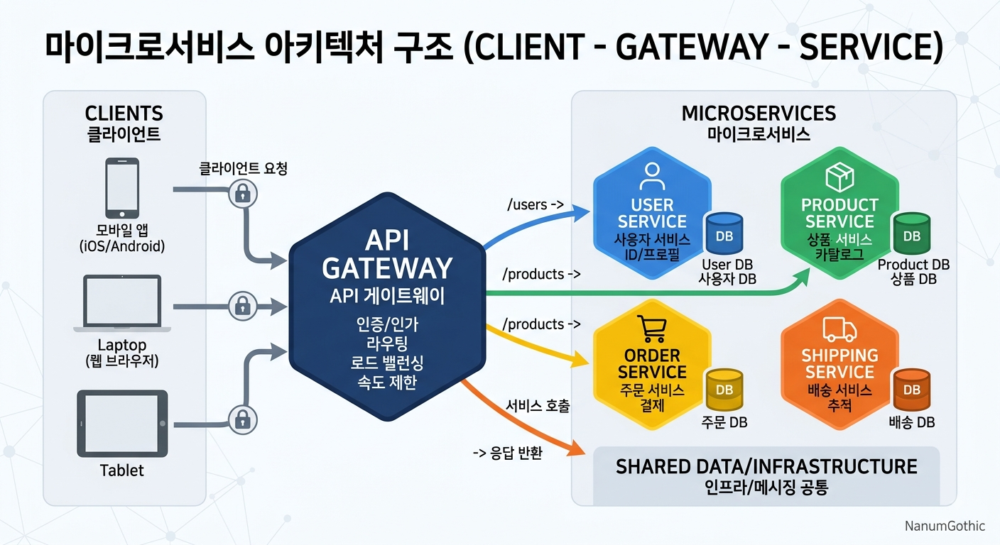

# Cloud

## 2. Cloud Native

### 5) Pillars of Cloud Native

- **CI/CD**
    - **개요**
        - CI(Continuous Integration - 지속적인 통합), CD(Continuous Deploy - 지속적인 배포, Continuous Delivery - 지속적인 서비스 제공)
        - 애플리케이션 개발 단계를 자동화하여 애플리케이션을 보다 짧은 주기로 고객에게 제공하는 방법
        - 새로운 코드 통합으로 인해 개발 및 운영 팀에 발생하는 문제(Integration Hell)를 해결하기 위한 방법
    - **흐름**

        | | |
        |----|----|
        | Development | CI(완전 자동화) |
        | Coding(자동화 X) - Push or Upload(자동화 X) | Build - Test - Merge(일부분은 Manual) |

        - `Continuous Delivery`
            - Acceptance Test(인수 테스트로 자동화) - Deploy to Staging(자동화) - Deploy to Production(Manual) - Smoke Test(새로운 빌드나 배포판이 나왔을 때 기본적인 기능은 제대로 동작하는지 빠르게 확인하는 테스트)
        - `Continuous Deployment`
            - Acceptance Test(인수 테스트로 자동화) - Deploy to Staging(자동화) - Deploy to Production(자동화) - Smoke Test(새로운 빌드나 배포판이 나왔을 때 기본적인 기능은 제대로 동작하는지 빠르게 확인하는 테스트)
    - `CI`
        - 개발 팀은 작은 변경 사항을 구현하고 코드를 버전 제어 레포지토리에 자주 체크인하도록 하는 코딩 철학이자 일련의 관행
        - 최신 애플리케이션은 다양한 플랫폼과 도구에서 개발을 하기 때문에 팀은 변경 사항을 통합하고 검증하기 위한 매커니즘이 필요
        - 기술 목표는 애플리케이션을 빌드, 패키징 및 테스트하는 일관되고 자동화된 방법을 설정하는 것
        - 통합 프로세스의 일관성을 유지하면 팀이 코드 변경을 더 자주 커밋할 가능성이 높아져 공동 작업과 소프트웨어 품질이 향상
        - 소프트웨어 공학에서는 지속적 통합은 지속적으로 품질 관리를 적용하는 프로세스를 실행하는 것
        - 작은 단위, 빈번한 적용, 지속적인 통합은 모든 완료한 뒤에 품질 관리를 적용하는 고전적인 방법을 대체하는 방법으로써 소프트웨어의 질적 향상과 소프트웨어를 배포하는데 걸리는 시간을 줄이는데 초점이 맞추어짐
        
    - **지속적인 제공(Continuous Delivery)**
        - 개발자들이 애플리케이션에 적용한 변경 사항이 버그 테스트를 거쳐 레포지토리(Git, Image Registry)에 자동으로 업로드는 되는 것
        - 운영 팀은 이 페로지토리에서 애플리케이션을 실시간 프로덕션 환경으로 배포
        - 개발 팀과 비즈니스 팀 간의 가시성과 커뮤니케이션 부족 문제를 해결
        - 지속적인 제공은 최소한의 노력으로 새로운 코드를 배포하는 것
    - **지속적인 배포(Coninuous Deployment)**
        - 개발자의 변경 사항을 레포지토리에서 고객이 사용 가능한 프로덕션 환경까지 자동으로 릴리스하는 과정
        - 애플리케이션 제공 속도를 저해하는 수동 프로세스로 인한 운영 팀의 프로세스 과부하 문제를 해결
        - 지속적인 배포는 파이프라인의 다음 단계를 자동화함으로써 지속적인 제공이 가진 장점을 활용
- **Containers**
    - **개요**
        - Linux 컨테이너는 실행에 필요한 모든 파일을 포함하여 전체 실행환경에서 애플리케이션을 패키지화하고 분리하는 기술
        - 전체 기능은 유지하면서 컨테이너화 된 애플리케이션을 환경(개발, 테스트, 생산 등) 간에 쉽게 이동 가능
        - 컨테이너 파이프라인에 보안을 구축하고 인프라를 보호하여 컨테이너의 안정성과 확장성 및 신뢰성을 보장할 수 있음
        - 가상화를 사용하지 않는 경우: 하나의 운영체제 위에 여러 개의 애플리케이션을 배치해서 실행을 하는 구조
        - KVM 가상화를 이용하는 경우: 운영체제 위에 Hypervisor를 배치하고 그 위에 Guest OS를 설치하고 그 위에 애플리케이션을 배치하는 구조로 애플리케이션을 분리하고자 하는 경우는 Guest OS를 여러 개 설치
        - Linux Container 이용하는 경우: 운영체제 위에 컨테이너를 각각 직접 배치하지만 격리가 됨
    - **DevOps 나 CI/CD 실현 기술 요소**
        - 개발자가 push -> Code Repository -> build tool -> Docker Build -> Image Registry -> Kubernetes 에 Deploy

## 3. Micro Service

### 1) 비즈니스 민첩성

- **성공한 인터넷 기업들의 가장 큰 장점이 비즈니스 민첩성(Agility)**
    - 이미 익숙한 비즈니스에 새로운 비즈니스 개념과 기술을 융합해 자신만의 서비스를 누구보다 빨리 실행하고 사용자 피드백을 끊임없이 반영해서 서비스를 개선
    - 초창기에는 성공 사례가 많지 않았지만 Cloud 의 등장과 이를 잘 활용한 Amazon 이나 Netflix 같은 기업의 사례에서 증명돼 실질적인 비즈니스 성과로 나타나고 있음
    - 아마존의 배포 속도는 2011년에 11.6초 정도였는데 지금은 초당 1.5번 이상으로 향상되었는데 0.66초마다 서비스를 업데이트 하는 것이 가능

    - **Cloud 인프라의 등장으로 배포 속도가 빨라짐**
        - 새로운 서비스 개발에 필요한 시스템 인프라를 준비하는데 오랜 시간이 걸리지 않음
    - **Cloud 인프라에 어울리는 애플리케이션의 조건**
        - 특정 서비스만 탄력성 있게 확장할 수 있어야함: 시스템을 작은 단위의 독립적인 서비스 연계로 구성
        - Cloud Friendly 와 Cloud Native
            - 작은 단위의 서비스 연계로 구성하지 않고 전체 시스템을 하나의 덩어리로 만들어 Cloud 인프라에 올려도 비즈니스를 제공하는데 전혀 문제가 없지만 특정 기능만 확장하거나 배포할 수 없는 비효율을 감수해야함.
            - Cloud Friendly 는 이전처럼 개발을 하고 Cloud 환경에 올라갈 수 있게만 한 Application
            - 독립적으로 분리되어 배포될 수 있는 조각들로 구성된 애플리케이션이 Cloud 인프라에 가장 어울리고 효과적이라는 의미에서 이를 `Cloud Native Application` 이라 부르며, 궁극적으로 Cloud Friendly 에서 Cloud Native 로 전이해야 한다고 함.

### 2) Micro Service

- **Monolithic 와 Micro Service**
    - `Monolithic`
        - Client <-> Server <-> 저장소
        - 하나의 단위로 개발되는 일체식 애플리케이션
        - 보통 3-Tier 라 불리는 사용자 인터페이스와 데이터 저장소 그리고 서버 애플리케이션으로 구성
        - 시스템을 확장해서 여러 개 존재하는 경우라면 변경이 발생하면 모두를 전부 다시 빌드하고 배포해야 한다. 
        - 이 경우는 스케일 업을 이용해서 확장을 수행해야 한다.
    - `Micro Service`

        

        - 서버 측이 여러 조각으로 구성돼 각 서비스가 별개의 인스턴스로 로딩되는데 여러 서비스 인스턴스가 모여 하나의 비즈니스 애플리케이션을 구성하고 각기 저장소가 다르므로 업무 단위로 모듈 경계를 명확하게 구분
        - 확장 시 특정 기능별로 독립적으로 확장할 수 있고 특정 서비스를 변경할 필요가 있으면 해당 서비스만 빌드해서 배포하면 됨
        - 배포 속도가 빨리진다.
        - 각 서비스가 독립적이어서 서로 다른 언어로 개발하는 것도 가능하므로 각 서비스의 소유권을 분리해 서로 다른 팀이 개발 및 운영하는 것도 가능

- **SOA 와 Micro Service**
    - **모듈화의 과정**
        - 단순히 기능을 하향식 분해해서 설계해 나가는 구조적 방법론
        - 객체 단위로 모듈화하기 위한 객체 지향 방법론
        - 모듈화가 단위가 기능별로 재사용할 수 있는 컴포넌트가 되는 `CBD(Component Based Development)`
        - 컴포넌트를 모아서 비즈니스적으로 의미있고 완결적인 서비스 단위로 모듈화 `SOA(Service Oriented Architecture)`
    - CBD 와 SOA도 넓게 보면 단위 컴포넌트나 서비스를 구성해서 시스템을 만드는 개념이고 Micro Service 와 매우 유사
    - Micro Service 는 Cloud 인프라 기술의 발전과 접목
    - Micro Service 기반으로 시스템을 개발하는 아키텍쳐 및 개발 방식을 `MSA(Micro Service Architecture)` 라고 함
    - **MSA 의 정의**: Amazon 과 Netflix 로 일컬어지는 인터넷 Unicorn 의 성공 과정을 지켜보다 뽑아낸 특징
        - 여러 개의 작은 서비스 집합으로 개발하는 접근 방법
        - 각 서비스는 개별 프로세스에서 실행되고 HTTP 자원 API 와 가벼운 수단을 사용해서 통신
        - 서비스는 비즈니스 기능 단위로 구성되고 자동화된 배포 방식을 이용하여 독립적으로 배포
        - 서비스에 대한 중앙 집중적인 관리는 최소화하고 서로 다른 언어와 데이터 저장 기술을 사용할 수 있음
        - 각 서비스와 저장소는 다른 서비스 및 저장소와 격리되어 있으며 API 를 통해서만 느슨하게 연계되기 때문에 독립적으로 확장 가능하고 하나의 서비스만 독립적으로 배포 가능하고 다른 서비스와 연계된 API에 영향을 주지 않는다면 내부의 언어나 저장소는 자율적으로 선택할 수 있음
        - 특정 서비스를 구축하는데 사용되는 언어나 저장소를 자율적으로 선택할 수 있는 방식을 `Polyglot` 하다로 표현
        - CBD/SOA 의 접근법에서는 애플리케이션은 모듈 별로 분리했으나 데이터 저장소까지는 분리하지 못함(여러 애플리케이션이 하나의 저장소를 공유해서 사용)

        - CBD/SOA에서는 강한 결합으로 애플리케이션도 독립적으로 사용하기가 힘들었는데 MSA에서는 SOA에 없던 2가지 개념을 추가
            - 다른 서비스가 저장소를 직접 호출하지 못하도록 캡슐화하는데 다른 서비스의 저장소에 접근하는 방법은 API 밖에 없음
            - REST API 같은 가벼운 개방형 표준을 사용해 각 서비스가 느슨하게 연계되고 누구나 쉽게 사용할 수 있음

- **Micro Service를 위한 조건**
    - 조직의 변화: 업무 기능 중심
        - 개발과 운영을 동시에 수행하는 팀
        - 다른 Micro Service 팀과 협력할 일이 줄어듦
    - 관리 체계의 변화: 자율적인 분권, 폴리글랏
    - **개발 생명 주기의 변화: 프로젝트가 아니라 제품 중심**
        - 기존 방식은 대부분의 애플리케이션 개발 모델이 프로젝트 단위였기 때문에 필요한 기술을 사용하는 인력들이 한시적으로 모여 장기간의 프로젝트를 통해 개발을 완료하고 나면 이를 운영 조직에 넘기는 방식으로 진행되어서 개발 조직과 운영 조직이 분리되어 있어서 프로젝트 기간 중에 발생한 변경이나 새로운 아이디어를 포용하기 어려움
        - 소프트웨어를 개발하는 방식 측면에서 프로젝트 형태의 폭포수 모델 또는 빅뱅 방식으로 진행하는 것이 아니라 점진 반복적인 모델 제품 중심의 Agile 개발 방식을 채용하는데 이 방식은 약 2~3주 단위로 sprint 를 통해 소프트웨어를 개발 및 배포하고 바로 피드백을 받아 소프트웨어에 반영할 수 있게 해주기 때문에 소프트웨어를 한시적으로 프로젝트를 통해 고객의 고정된 요건을 받아 이 기능이 만족되면 제공 및 전달하는 개념으로 보지 않고 요건의 변환에 따라 지속적으로 개선되고 발전시킬 제품으로 바라봄
    - **개발 환경의 변화: 인프라 자동화**
        - `Micro Service` 는 독립적으로 배포
        - Monolithic 처럼 한 덩어리로 배포하는 경우는 수동으로 배포해도 되지만 Micro Service 처럼 여러 개로 쪼개진 상태에서는 수동으로 배포하는 방식은 바람직하지 않음
        - 전체 소프트웨어를 구현하는 과정을 개발 환경을 준비하는 과정, 실제 소프트웨어를 개발하는 과정, 개발 완료된 소프트웨어를 빌드, 테스트, 배포하는 개발 지원 과정으로 구분
        - 개발 환경을 준비하는 과정을 Cloud 인프라를 활용하면 쉽고 빠르게 준비하는 것이 가능
        - 개발 지원 과정을 빠르게 만들기 위한 방법은 **자동화** 하는 것인데 이런 환경은 개발과 운영을 동시에 수행하는 DevOps를 궁극적으로 가능하게 하므로 `데브옵스 개발환경`이라 칭하기도 하며 `인프라 자동화`라고 하기도 하는데 Micro Service 개발 과정의 필수 조건

    - **배포 파이프라인 자동화**
        - 빌드(컴파일 및 유닛 테스트) -> 개발환경에 배포(기능 테스트) -> 테스트 환경 배포(통합 테스트) -> 스테이징 환경 배포(인수 테스트, 성능 테스트) -> 운영 환경 배포
        - Staging 환경: 운영 환경과 거의 동일한 환경을 만들어 놓고 운영 환경으로 이전하기 전에 Security, 성능, 장애 등의 비기능적 부분을 검증하는 과정

        - 빌드/배포 파이프라인 프로세스는 도구를 통해 자동화해야 하는데 최근에는 배포 환경이 Micro Service 개수에 따라 급격하게 늘어나기 때문에 이를 효율적으로 관리하기 위해 인프라 구성과 자동화를 마치 소프트웨어처럼 코드로 처리하는 방식인 IaC가 각광받고 있음

    - **저장소의 변화**: 통합 저장소가 아닌 분권 데이터 관리
        - Monolithic 은 단일 통합 데이터베이스를 이용
        - 단일 데이터베이스를 유지하는 방식은 과거 스토리지 가격 및 네트워크 속도에 따른 데이터의 안정성과 효율성을 추구한 결과로 데이터를 잘 정리하는 정규화가 반드시 추구해야 할 가치였지만 지금은 스토리지 가격이 저렴하고 네트워크 대역폭이 매우 커져서 데이터를 억지로 뭉쳐서 작은 공간에 넣을 필요가 없음
        - Micro Service는 폴리글랏 저장소 접근법을 선택하며 서비스별로 데이터베이스를 갖도록 설계하는데 각 저장소가 서비스 별로 분산되어 있어야 하며 다른 서비스의 저장소를 직접 호출할 수 없고 API를 통해서만 접근해야 한다.
        - 이러한 구조에서는 비즈니스 처리를 위해 일부 데이터의 복제와 중복 허용이 필요한데 여기서 반드시 등장하는 문제가 각 Micro Service의 저장소에 담긴 데이터의 비즈니스 정합성을 맞춰야 하는 데이터 일관성 문제
        - 데이터 일관성 처리를 위해서는 보통 `2단계 커밋(2PC)` 같은 분산 트랜잭션 기법을 사용하는데 각각 다른 서비스를 하나의 트랜잭션으로 묶다보면 각 서비스의 독립성이 침해되고 NoSQL처럼 2단계 커밋을 지원하고 있는 경우도 있기 때문에 Micro Service는 데이터 일관성 문제를 하나의 트랜잭션으로 묶는 기법이 아닌 비동기 이벤트 처리를 통한 협업을 강조하는데 이를 가리켜서 `결과적 일관성(Eventual Consistency)` 이라는 개념으로 표현하는데 어느 순간에는 두 서비스의 데이터가 일치하지 않을 수 있지만 결국에는 두 개의 데이터는 같아진다라는 개념
        - 여러 트랜잭션을 하나로 묶지 말고 별도의 로컬 트랜잭션을 각각 수행하고 일관성이 달라진 부분은 체크해서 보상 트랜잭션으로 일관성을 맞추는 개념을 활용
        - 트랜잭션을 분리하고 `Queue 매커니즘`을 이용하는 방법 - 주문과 배송을 분리해서 구현한 경우
            - 주문 서비스가 주문 처리 트랜잭션을 발행
                - 주문 이벤트를 발행
                - 주문 이벤트가 큐로 전송
                - 배송 서비스가 주문 이벤트를 인식
                - 배송 서비스가 주문 처리에 맞는 배송 처리 트랜잭션을 수행
                - 배송 서비스가 트랜잭션을 처리하는 도중 오류가 발생한 경우
                    - 배송 처리 실패 이벤트를 발행
                    - 배송 처리 실패 이벤트가 메시지 큐로 전송
                    - 주문 서비스가 배송 처리 실패 이벤트를 인식해서 주문 취소를 수행

    - **위기 대응 방식의 변화: 실패를 고려한 설계**
        - 소프트웨어는 모두 실패한다라고 하는데 시스템은 언제든 실패할 수 있으며 실패해서 더는 진행할 수 없을 때도 자연스럽게 대응할 수 있도록 설계해야 한다는 의미로 `내결함성(fault tolerance)` 이라고 함
        - 실패하지 않는 시스템을 만드는 것보다 실패에 빠르게 대응할 수 있는 시스템을 만드는 것이 더 쉽고 효율적이라는 것인데 이를 위해서는 다양한 실패에 대해서 완벽히 테스트할 수 있는 환경을 마련해야 되고 시스템의 실패를 감지하고 대응하기 위해 실시간 모니터링 체계도 갖추어야 함.
        - 이러한 예로 `Circuit Breaker` 패턴이 있는데 이 패턴은 회로 차단기처럼 각 서비스를 모니터링 하고 있다가 한 서비스가 다운되거나 실패하면 이를 호출하는 서비스의 연계를 차단하고 적절하게 대응하는 것을 의미하는데 이러한 설계는 서비스가 긴급 장애 상황에 빠르고 유연하고 탄력적으로 대응할 수 있게 함.
        - 주문 서비스 -> 결제 서비스 -> 카드사 API 를 연계하는 경우 결제 서비스가 장애가 발생한 경우 잘못하면 주문 서비스가 결제 서비스 요청을 계속하게 돼서 스레드, 커넥션, CPU 가 고갈될 수 있음(그래서 message queue가 필요함, msa에서 적절히 mq를 활용해야 한다.)
        - 넷플릭스에서는 카오스 몽키(chaos monkey) 라는 장애를 일부러 발생시키는 도구를 만들어서 탄력적인 아키텍쳐가 제대로 동작하는지 점검
        - 서킷 브레이커 구현 기술로는 `Resilience4j, Spring Cloud Circuit Breaker, Istio/Envoy` 등이 있음
        - 장애가 난 서비스를 계속 호출하지 말고 잠시 차단해서 장애가 전체 시스템으로 전파되는 것을 막는다.
        - **많이 사용하는 환경**
            - AWS Lambda -> 외부 API
            - EKS/Kubernetes -> 다른 Microservice
            - API Gateway -> Backend
            - MSA 서비스 간 REST/gRPC 호출
            - 외부 결제, 인증, 배송 API 호출
            - DB/Redis 등 외부 의존 서비스

- **리액티브 선언: 현대 애플리케이션이 갖춰야 할 바람직한 속성등**
    - 현대 애플리케이션에 대한 기대를 잘 표현한 문서가 있는데 이 문서의 이름은 `리액티브 선언`으로 이 선언문에는 응답성, 탄력성, 유연성 그리고 메시지 기반이라는 4가지 특성을 강조하고 이러한 요건을 만족하는 시스템을 리액티브 시스템이라고 정의 
    - **리액티브 선언 4가지 요소**
        - `응답성(Responsive)`: 사용자에게 신뢰성 있는 응답을 빠르고 적절하게 제공하는 것
        - `탄력성(Resilient)`: 장애가 발생하거나 부분적으로 고장나더라도 시스템 전체가 고장나지 않고 빠르게 복구하는 능력
        - `유연성(Elastic)`: 시스템의 사용량에 변화가 있더라도 균일한 응답성을 제공하는 것을 의미하는데 시스템 사용량에 비례해서 자원을 늘리거나 줄이는 성질

        - `Message Driven`: 비동기 메시지 전달을 통해 위치 투명성, 느슨한 결합, 논블로킹 통신을 지양하는 것
    - 4가지 요소 모두 리액티브 시스템을 만들기 위한 요소이고 각 요소는 상호 보완적
    - 예전에는 아키텍처의 구성 요소들을 각 기업이나 특정 벤더의 제품에 전적으로 의존해서 구축하거나 수정이 필요한 부분만 별도로 직접 개발하는 경우가 많았기 때문에 특정 벤더 솔루션이나 프레임워크가 변경될 경우 그것에 의존하는 애플리케이션의 많은 부분들을 변경해야 할 정도로 강 결합돼 있었는데 이처럼 특정 벤더 중심의 아키텍처는 검증된 유명 제품 군을 사용한다는 점에서 품질이 보장된다고 생각할 수 있는 반면 특정 벤더에 의존한다는 점에서 특정 기술에 Lock-In 되어 쉽게 변경하거나 확장하지 못한다는 단점이 있음
    - 최근에 이러한 분위기를 바꿔 하나의 벤더에 의존하거나 직접 구축할 필요가 적어졌는데 Cloud 환경하에서 사용되는 오픈 소스 또는 오픈 소스를 기반으로 하는 상용 제품들이 이전의 유명 벤더의 제품군만큼이나 품질이 높아지고 다양한 기능을 지원하면서 서로 다른 오픈 소스 간에도 충분한 호환성을 제공하기 때문
    - 최근 아키텍처 설계문서들을 보면 각 솔루션의 로고로 채워지는 경향이 있는데 이것은 아키텍쳐링이 유연하고 호환성 있는 적절한 솔루션 및 오픈 소스를 선택하는 과정임을 보여줌

- **강결합에서 느슨한 결합의 아키텍쳐 변화**
    - 이전의 강결합 위주의 Monolithic 아키텍쳐가 유연하고 느슨하게 결합되는 Micro Service 기반 아키텍쳐로 변화하고 있음
    - 각 구성 요소들은 대체하거나 변경할 수 있도록 구성

- **MSA 구성 요소 및 MSA 패턴**
    - **인프라 구성 요소**
        - Public Cloud, Private Cloud, Baremetal 을 이용할 것인가 하는 문제
        - VM과 컨테이너
        - 컨테이너 오케스트레이션
        - **Backing Service**: 데이터에 대해 정의하는 부분
            - Persistence: RDBMS, NoSQL
            - Cache: 데이터 캐시를 정의(Redis)
            - Message Broker: Queue 등을 이용한 메시지 전달 매체와 방법을 의미(Kafka, Rabbit MQ)
        - `Telemetry`
            - 마이크로 서비스는 각 서비스들이 분리되어 있기 때문에 각 서비스 간의 로그를 한데 모아야 하는 이슈, 각 서비스가 어떻게 호출되었는지 추적해야 하는 이슈, 그리고 각 서비스에 대한 모니터링 이슈가 발생
            - `Logging`
                - 여러 개로 분리된 서비스에서 생성된 분산된 로그 파일에 대한 중앙화, 집중화 방안
                - `ELK(Elastic Search, Logstash, Kinaba), EFK(Elastic Search, Fluented, Kibana)`
            - `Trace`
                - 클라이언트의 단일 요청에 대해 마이크로서비스 간 다중 호출 관계가 있을 떄 이에 대한 추적 방안
                - `Spring Cloud Sleuth` 또는 `Micrometer Tracing`
                - `Zipkin`, `Jaegar` 는 분산 시스템에서 요청이 여러 서비스를 거치는 과정을 추적하는 Distributed Tracing
            - `Monitoring`
                - 다중화된 서비스에 대한 모니터링 방안
                - 어떤 요청이 어떤 인스턴스를 거쳐 처리되었고 장애가 어디서 발생했는지
                - CPU, Memory, Application 상태, Node 상태, Network I/O, Disk 사용량, HPA 동작 상태 등
                - `Prometheus/Grafana` 조합을 많이 사용
            - `Prometheus + Grafana + OpenTelemetry + EFK + Jaegar` 의 조합을 많이 사용
        - `CI/CD`
            - Habor(이미지 저장소), Helm(k8s 패키지 관리자), Jenkins(빌드 도구), Git(분산 버전 관리 시스템), Gradle(빌드 도구), maven(빌드 도구), junit(단위 테스트), sonarqube(정적 코드 분석 도구), nexus(소프트웨어 패키지아 빌드 산출물을 저장하는 저장소), jacoco(코드 커버리지 - 코드가 얼마나 테스트 되었는가를 측정)등
        - **그 밖의 다양한 Cloud 인프라 서비스**
            - `IaaS`
                - 인프라를 제공하는 서비스
                - AWS의 EC2, GCP의 Compute Engine, Azure의 VM
            - `CaaS`
                - 컨테이너 기반 가상화를 이용하는 서비스
                - AWS 의 ECS와 EKS, GCP의 GKE, Azure는 AKS
            - `PaaS`
                - IaaS 위에 개발 및 실행 관리할 수 있는 플랫폼 환경을 제공해주는 것인데 실제로 애플리케이션이 실행될 수 있는 미들웨어나 런타임까지 탑재된 환경
                - Azure Web App, Google 의 App Engine, AWS Elastic Beanstalk, Cloud Foundry, Heroku 등
    - **플랫폼 패턴**
        - 인프라 환경 위에서 애플리케이션을 운영하고 관리하는 환경을 구성하는 방법을 생각해야 한다.
        - 개발 지원 환경: 데브옵스 인프라 환경
        - 빌드/배포 파이프라인 설계
        - 다양한 서비스의 등록 및 탐색을 위한 서비스 레지스트리, 서비스 디스커버리 패턴
            - **서비스 디스커버리**: Front End Client 가 여러 개의 Back End Micro Service 를 어떻게 호출하고 스케일 아웃을 통해 인스턴스가 여러 개로 복제된 경우 어떻게 부하를 적절히 분할할까 하는 것들을 위한 패턴
            - 클라이언트가 여러 개의 Micro Service를 호출하기 위해서는 최적 경로를 찾아주는 라우팅 기능과 적절한 부하분산을 위한 로드밸런싱 기능이 제공이 되어야 하는데 Netflix 의 OSS에서는 라우팅 기능은 Zull이 로드밸런싱은 Ribbon이 담당
            - **서비스 레지스트리 패턴**: Cloud 환경에서 동적으로 변경되는 유동 IP 정보를 매번 전송 받아서 호출하는 것은 적절하지 않아서 제 3의 공간에서 이러한 정보를 관리하는 것이 좋은데 Back End Micro Service 명칭과 유동적인 IP 정보를 매핑해서 보관하는 장소가 필요한데 이렇게 별도의 장소에서 매핑해서 사용하는 패턴
            - 이러한 패턴을 다른 솔루션에서도 제공하는데 쿠버네티스의 경우 이 같은 서비스 레지스트리, 디스커버리 기능을 자체 기능인 쿠버네티스 DNS 및 서비스로 제공
        - **서비스 단일 진입을 위한 API Gateway 패턴**
            - 여러 클라이언트가 여러 개의 서버 서비스를 각각 호출하게 된다면 매우 복잡한 호출 관계가 만들어질 것인데 이러한 복잡성을 통제하기 위한 방법이 필요
            - 이 해결책 중 하나가 `API Gateway`: 다양한 클라이언트가 다양한 서비스에 접근하기 위해서는 단일 진입점을 만들어 놓으면 여러모로 효율적인데 이 지점에서 라우팅, 로드밸런싱, 인증/인가, 추적, 장애 격리, 서비스 탐색 등을 수행할 수 있다.
            - Spring Cloud 의 `API Gateway Service` 그리고 Kubernetes 의 Service 와 `Ingress resource` 로 제공
            - `Istio`를 이용해서 구현 가능
        - **BFF 패턴**
            - 최근에는 클라이언트의 종류가 다양해짐
            - 다양한 클라이언트를 위해서는 특화된 처리를 위한 API 조합이나 처리가 필요한데 이를 위한 해결방법으로 BFF(Backend For Frontend) 패턴이 있음
            - 클라이언트 종류에 따라 최적화된 처리를 수행할 수 있게 게이트웨이를 여러 개 구성하는 패턴
        - **외부 구성 저장소 패턴**
            - Cloud 인프라와 같이 유연한 인프라를 사용하는 상황에서 데이터베이스 연결 정보, 파일 스토리지 정보 같은 내용을 애플리케이션에 포함시키면 변경 시 반드시 재배포를 해야 하는데 이 경우 서비스를 중단해야 하고 여러 Micro Service 가 동일한 구성 정보를 사용하는 경우에 일일이 변경하기가 어렵고 변경 시점에 Micro Service의 구성 정보가 불일치 할 수도 있기 떄문에 Micro Service 가 사용하는 자원의 설정 정보를 쉽고 일관되게 변경 가능하도록 관리할 필요가 있음
            - 각 Micro Service의 외부 환경 설정 정보를 공동으로 저장하는 백업 저장소
            - 환경 정보를 Git 같은 별도의 형상 관리 레포지토리에 보관하고 Spring Cloud Config 같은 기능을 이용해서 이를 가져와서 해당 서비스에 주입하거나 쿠버네티스에서는 ConfigMap으로 이 기능을 제공
        - **인증/인가 패턴**
            - 각 서비스가 모두 인증/인가를 중복으로 구현한다면 비효율적
            - **중앙 집중식 세션 관리**
                - 서버 세션에 사용자의 인증/인가 정보를 저장하지 않고 공유 저장소에 세션을 저장하고 모든 서비스가 동일한 사용자 데이터를 얻게 하는데 이 때 세션 저장소로 보통 `redis` 나 `memcached` 를 이용
            - **클라이언트 토큰**
                - 세션은 중앙 서버에 저장되고 토큰은 사용자의 브라우저에 저장하는 방식
                - 토큰은 사용자의 신원 정보를 가지고 있고 서버로 요청을 보낼 때 전송되기 때문에 서버에서 인가처리를 할 수 있음
                - `JWT(JSON Web Token)`를 이용
            - API Gateway 를 이용한 클라이언트 토큰
        - **장애 및 실패 처리를 위한 서킷 브레이커 패턴**
        - **모니터링과 추적 패턴**
        - **중앙화된 로그 집계 패턴**
        - **Service Mesh 패턴**
            - MSA 문제 영역 해결을 위한 기능(서비스 탐색, 서킷 브레이커, 추적, 로깅, 로드밸런싱 등)을 비즈니스 로직과 분리해서 네트워크 인프라 계층에서 수행하는 `Service Mesh`
            - `Istio` 가 대표적인 구현체
            - `Istio` 는 애플리케이션이 배포되는 컨테이너에 완전히 격리되어 별도의 컨테이너로 배포되는 사이드카 패턴을 적용해서 서비스 디스커버리, 라우팅, 로드 밸런싱, 로깅, 모니터링, 보안, 트레이싱 등의 기능을 제공
    - **애플리케이션 패턴**
        - `Monolithic Front End`
        - `UIComposite Pattern` 또는 `Micro Front End`
        - 통신 패턴
            - `동기 통신 방식`: 일반적인 REST API 호출
            - `비동기 통신 방식`: AWS의 SQS나 SNS 등을 이용하면 비동기 통신 방식을 쉽게 구현
        - 저장소 분리 패턴
        - **분산 트랜잭션 패턴**
            - 2단계 커밋을 통한 분산 트랜잭션 처리는 독립적이지 않고 비자율적
            - `Saga 패턴`
                - 여러 개의 분산된 서비스를 하나의 트랜잭션으로 묶지 않고 각 로컬 트랜잭션과 보상 트랜잭션을 이용해서 비즈니스 및 데이터의 정합성을 맞추는 방법
                - 각 로컬 트랜잭션은 자신의 저장소를 업데이트 한 다음 다음 사가 내에 있는 다음 로컬 트랜잭션이 트리거하는 메시지 또는 이벤트를 게시해서 일관성을 맞추는 방식
                - 롤백이 필요하다면 `보상 트랜잭션`을 이용하는 방식
        - 데이터 일관성에 대한 생각의 전환: 결과적 일관성
        - **읽기와 쓰기 분리**: `CQRS(Command Query Responsibility Segregation) 패턴`
            - 명령 조회 책임 분리
            - 기존의 일반적이던 동일한 저장소에 데이터를 넣고 입력, 조회, 수정, 삭제를 모두 처리하는 방식에 도전하는 패러다임
            - 하나의 저장소에 쓰기 모델과 읽기 모델을 분리하는 방식으로 변화시켜 쓰기 서비스와 조회 서비스를 분리할 수도 있고 더 나아가 아예 물리적으로 쓰기 트랜잭션용 저장소와 조회용 저장소를 분리시킬 수 있음(읽기는 NoSQL이 좋음, 쓰기에는 RDBMS를 주로 이용)